# PBIP ↔ PBIX：网页与 MCP 完整方案及实操指南

> 公开版说明：保留原技术叙事与合成场景观察，部署定位参数已改为占位符。内部任务、身份、部署及截图来源回执不随仓库发布；公开成品与经过字段精简的 verification 见 [examples](../examples/README.md)。请先用自己的获准环境参数替换占位符。

从已有报表回到可编辑工程，再把工程交付为成品

你可能从两个地方开始：手里已有一份 Power BI Desktop 的 PBIX，想把模型与页面导成可编辑、可审阅的工程；也可能已经用开发工具或 AI 生成了 Power BI Project（PBIP），现在需要交付可直接打开的 PBIX。前者让已有资产进入代码工作流，后者让工程回到文件交付流程。

本项目把两个方向放到同一套受控 Windows 环境：用户通过公网 HTTPS 网页或程序提交文件，远端 Desktop 打开并执行原生 Save As，再以新进程重新打开输出。普通用户只看自己的任务，程序通过 MCP（Model Context Protocol）工具协议使用同一身份和队列；真正理解工程、保存模型和报表的仍是 Desktop。公网网关负责安全传递请求，不把转换搬到浏览器或 Linux 网关中。

本文用三行销售数据贯穿概念、数据模式和实操：从 60 理解模型与页面，再看导出的工程要不要带数据缓存，最后完成往返、多页与关系、重复运行和恢复。独立横评与安全成本仍以交付终点为依据。项目入口见 [README](README.md)；只需云上试用时，直接按[运行手册的用户步骤](02-日常复跑与运维.md)操作，管理员负责其后的环境准备。

## 阅读目录

第 1 章 从想交付的结果开始

第 2 章 工程里有什么，Desktop 保存了什么

第 3 章 一次请求怎样经过整套系统

第 4 章 动手之前：环境、权限与三个执行位置

第 5 章 从网页登录到取回成品，再看管理员怎样准备环境

第 6 章 从一个卡片扩展到多页、关系与连续任务

第 7 章 第二次运行：任务接口与持续维护

第 8 章 失败后怎么判断、怎么恢复

第 9 章 独立横向比较：什么时候不该使用转换器

第 10 章 部署决策：安全、成本与运行责任

附录 A 术语与命令索引

附录 B 样例、源码与运行记录

附录 C 官方资料与实现依据

首次学习先读第 1—3 章，理解文件、数据与请求路径；第 4 章是环境条件，第 5 章先给已有服务的网页使用流程，再给管理员的完整桌面与 SSH 操作。第 6 章扩展到往返、多页和关系，第 7—8 章供接口接入与排障查阅，第 9—10 章帮助作部署决策。

## 第 1 章 从想交付的结果开始

### 1.1 用最小数据看懂“成功”

先看最小样例的数据。`Sales` 是销售表，`Category` 是类别列，`Amount` 是金额列。

| Category | Amount |
|---|---:|
| A | 10 |
| B | 20 |
| C | 30 |

模型里有一个名为 `Total Amount` 的度量值，它把当前筛选范围内的金额相加。报表上放置一个卡片视觉对象，并让它显示这个度量值。没有额外筛选时，卡片应显示 **60**。这个数把三层内容连在一起：数据已经进入模型，计算定义能执行，报表也确实绑定到了正确的计算。

下面的成品概览中，先看 `Total Amount` 卡片的 **60**，以及 A、B、C 的柱形图。它还带有扩展样例的加权金额 **200**：三类金额分别乘以 2、3、4 后得到 20、60、120，再求和。第 6 章将用这个新增结果解释表关系如何参与计算；这里先用 60 把数据、计算和展示对应起来。

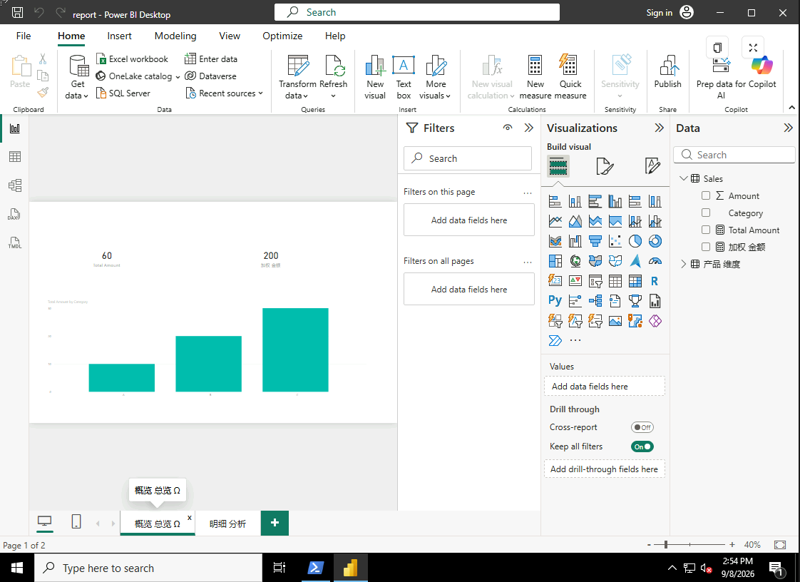

图 1：新 Desktop 进程打开扩展 PBIX 的概览页。先把总金额 60 与三根分类柱对应，再看加权金额 200；后者需要模型中的产品权重关系共同参与计算。

### 1.2 一个文件出现了，还缺哪些判断

一次转换有几个可分别观察的结果：请求被接收、目标文件生成、文件能够重新打开、内容符合所选数据模式。PBIX 和带缓存的 PBIP 可以继续检查数值；只导出定义的 PBIP，则应检查模型与页面定义，并明确后续的数据加载条件。不能用“文件出现了”代替这两类不同的判断。

| 观察点 | 它回答的问题 | 后续判断 |
|---|---|---|
| 返回任务 ID，状态为 `queued`（排队） | 请求已经接收，可以按 ID 查询 | 等待执行结果 |
| 指定输出位置出现非空文件 | Desktop 的保存步骤产生了文件 | 检查结构并重新打开 |
| 结构检查和新进程复开完成，状态为 `succeeded`（成功） | 输出满足该方向及数据模式的保存/打开要求 | 带数据结果核对业务值；定义工程核对结构与加载条件 |
| 基线卡片显示 60 | 数据、聚合和卡片绑定符合样例预期 | 换用自己的工程时，定义相应业务验收点 |

这个终点也划出了转换工具在完整交付流程中的责任：

| 交付阶段 | 输入 | 输出 | 责任 |
|---|---|---|---|
| 准备内容 | 需求、数据和业务口径 | 表、计算、页面和字段绑定 | 工程作者准备并审查 |
| 导出工程 | 受信任、带本地模型的 PBIX | PBIP ZIP，选择定义或带缓存模式 | 本项目经网页或 MCP 接收，Desktop 保存后复开 |
| 交付成品 | 完整 PBIP 工程及所需缓存 | 可由 Desktop 重新打开的 PBIX | 同一队列执行，按任务交回产物 |
| 发布与在线使用 | 模型、报表定义或 PBIX | 服务中的报表、权限、刷新与嵌入入口 | 交付流程另行安排，第 9 章比较在线路线 |

销售 PBIX 既可作为成品，也可作为反向导出的输入。随附的[带缓存工程](../examples/Sales-portable-c268.pbip.zip)再转回[往返 PBIX](../examples/Sales-roundtrip-5a09.pbix)，新进程仍显示 60；输入摘要的关联见[示例索引](../examples/README.md)。理解这条路径，需要先拆开数据、计算、页面和缓存分别保存在哪里。

## 第 2 章 工程里有什么，Desktop 保存了什么

### 2.1 模型决定怎么算，报表决定怎么看

把 Power BI 想成一个由“数据与计算”和“展示与交互”组成的作品，比把它想成“一堆图”更容易理解。**语义模型**负责组织表、列、关系和度量值；**报表**负责页面、卡片、柱形图、表格、筛选器，以及这些视觉对象绑定哪些字段。

在销售例子里，`Sales[Amount]` 保存的是每行金额。`Total Amount` 不是另外手填的 60，而是一段计算规则。把类别 A 作为筛选条件，度量值会在这个筛选上下文里得到 10；去掉筛选，才回到 60。这样，同一个模型可以服务多张报表，而报表可以用不同布局展示同一口径。

下面用模型计算语言 DAX 表达这个规则。这是样例中已有的模型定义，阅读时关注 `SUM` 如何对金额求和，不在 PowerShell 中执行：

```dax
Total Amount = SUM(Sales[Amount])
```

三种修改带来的变化也不同。把金额从 10 改成 100 是数据变化，需要数据加载或刷新后才能反映；把 `SUM` 改为其他计算是模型逻辑变化；把卡片移到左上角是报表布局变化。转换器应把你交给它的工程保存成文件，而不是未经许可同时修改三层内容。

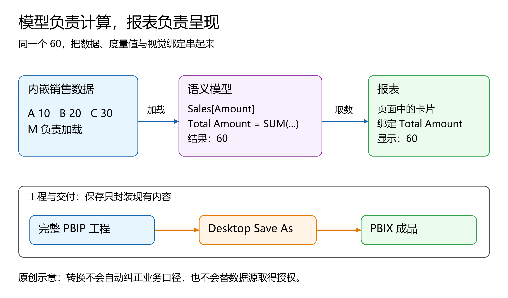

图 2：沿左侧“数据加载 → 模型计算”读到 60，再看报表如何引用该结果。下面的保存路径把模型和报表封装为文件；重新打开时，仍要能恢复上面的计算与展示。

### 2.2 从数据加载到页面定义

**Power Query 与 M**描述数据从哪里来、怎样清洗和加载。它们可以从内嵌表读取，也可以连接文件、数据库和其他系统。**DAX**描述模型上的计算，例如总金额或同比增长；它不等同于读取数据库的连接过程。在本例中，M 先创建三行数据，DAX 再计算合计；如果数据没有加载，公式本身写对也未必能显示 60。

**TMDL** 是用于表达表格语义模型的文本定义语言。它可以把表、列、关系、度量值和分区定义分成便于阅读及版本管理的文件。**PBIR** 则是报表定义格式：哪几页、每页放哪些视觉对象、位置和字段绑定是什么。项目既有 TMDL 又有 PBIR，并不是重复，而是分别描述模型和报表。[3][4]

**TOM** 是操作表格模型的对象模型，**XMLA** 是模型连接与管理所用的接口体系。它们可以用于读取或修改模型元数据、执行模型相关操作，但“模型能被操作”并不意味着“报表页、视觉布局与整个 PBIX 文件已经生成”。因此，不能仅因为一个工具支持 XMLA、TOM 或 TMDL，就认定它能做完整 PBIP → PBIX 转换。

| 名称 | 在本例里对应的对象 | 不应误解成 |
|---|---|---|
| Power Query / M | 创建或加载三行销售数据的规则 | 纯文本配置、没有执行风险 |
| DAX | `Total Amount`、`加权 金额` 的计算 | 报表画布布局语言 |
| TMDL | `Sales.tmdl`、关系和产品维度定义 | 包含所有报表页面的成品文件 |
| PBIR | 页名、卡片、柱形图、表格及绑定 | 负责运行 DAX 的计算引擎 |
| TOM / XMLA | 面向语义模型的编程与连接能力 | 通用的 PBIP/PBIX 文件转换接口 |

### 2.3 PBIP 是工程入口，PBIX 是保存产物，PBIT 是模板

PBIP 项目不是一个独立的 `.pbip` 文件。这个文件更像工程入口：它指向报表目录，报表再通过相对路径引用语义模型目录。真正的页面、视觉对象、模型和计算散落在这些目录中。只传入口，等于只寄出一本书的目录，却没有寄正文。

下面列出最小工程中的主要文件及相互位置。首次运行使用随包完整样例；阅读这棵目录树是为了理解引用关系，不必手工重建工程。

```text
sample\Synthetic\
  Synthetic.pbip
  Synthetic.Report\
    definition.pbir
    definition\
      version.json
      report.json
      pages\
        pages.json
        SyntheticOverview\
          page.json
          visuals\
            TotalAmountCard\
              visual.json
  Synthetic.SemanticModel\
    definition.pbism
    definition\
      database.tmdl
      model.tmdl
      tables\
        Sales.tmdl
```

这是工程结构示意，不是执行命令。Desktop 官方允许在更大的目录中保存多个报表或模型；**本 Demo 的入口规则更窄**：每次 ZIP 恰好一个 `.pbip`，入口只指向一个报表，报表使用包内的本地模型相对引用。多个入口、远端模型连接或缺失目录会被拒绝，这是服务的输入契约，不是 Power BI 对所有项目的普遍限制。[1]

PBIX 是 Desktop 保存的封装文件。它可以承载模型和报表；本项目要求输出中有非空二进制 `DataModel`，并核对报表页和视觉对象数量。PBIX 内部虽有包结构，兼容的成品还依赖模型序列化、版本和定义处理。因此，微软官方 FAQ 给出的 PBIP/PBIX 转换入口是 Desktop 的 **File → Save as**，目前没有官方公开的程序化转换 API。[1] 本项目调用的就是这个保存流程，而不是自行拼装二进制模型。

PBIT 是模板，用于复用报表和模型的结构，而不是打包一份同样的数据快照。打开含数据源定义的模板时，通常仍需提供参数、凭据并加载数据。所以“我得到了 PBIT”与“我得到了可复开且含本次数据的 PBIX”不是同一验收结果。模板的筛选值等仍可能保存在元数据中，不应把“不含模型数据副本”误解成自动完成脱敏。[5]

| 格式 | 适合扮演的角色 | 本文怎么使用 |
|---|---|---|
| PBIP 工程 | 文本化编辑、Git 差异、批量生成与审查 | 可以上传完整文件夹或 ZIP，也可以从 PBIX 导出 |
| PBIX | Desktop 文件交付与后续打开 | 可以作为输出，也可作为导出工程的输入 |
| PBIT | 结构模板复用，后续再提供数据条件 | 不把它当作本次 PBIX 的替代成功 |
| ZIP | 传输完整工程的包装 | 是输入载体，不是转换算法 |

PBIP 可以有模型定义，却没有 `.pbi\cache.abf` 数据缓存。定义描述“怎样加载和计算”，缓存保存已导入的模型数据；没有缓存时，打开工程不等于离线数值已经可用。[4] 因此，PBIX 导工程要明确选择以下模式：

| 导出模式 | 工程中保留什么 | 打开和回转的含义 |
|---|---|---|
| `definitions`，默认 | 当前报表/模型定义及允许的静态资源；去掉模型缓存、本机设置 | 适合编辑和版本管理；复开检查结构，数据需要另行加载 |
| `portable`，可选 | 同样的定义，加上本任务 Desktop 导出的非空 `cache.abf` | 在支持条件下离线打开并转回 PBIX；缺缓存时明确失败 |

**definitions 不等于脱敏包。** Sales 的三行数据本来就写在 M 定义中；移除缓存不会删掉这段定义。其他工程的查询、模型文本和连接信息同样可能敏感。portable 额外带有数据缓存，应按原 PBIX 的敏感级别保护，并且只能使用当前任务产生的缓存，不能从另一个用户或旧任务补一份。

回转 PBIX 时，只有**逐文件精确匹配的内置样例**允许自动刷新。其他工程必须自带可用缓存，否则返回 `DATA_CACHE_REQUIRED`；转换器不会代替用户登录外部数据源或执行任意刷新。选择 definitions 的读者若后续需要成品，应先在批准环境中处理数据加载与凭据，再重新提交；需要保留已有离线数据时，应从原 PBIX 选择 portable。

回执中的 `contains_data` 表示是否含缓存或二进制模型，不是“已经逐行确认所有数据”。`requires_data_reload` 说明加载责任；`data_values_verified` 只在可信样例观察到指定结果时为 true。普通业务模型仍需用自己的验收口径核对。

### 2.4 MCP 是调用规则，不是必需的大模型

MCP 的作用可以理解为“让客户端知道有哪些工具、参数怎样传、结果怎样取”。本例公布 `submit_project` 等工具，客户端按协议调用，服务端接收请求并安排任务。工具协议把调用双方连接起来，业务计算与文件保存仍由各自的处理程序执行。[6]

**Agent** 是能够选择和调用工具来完成任务的程序，可以在上游依据用户意图决定调用哪个工具；**LLM** 即大语言模型，可以帮助它理解自然语言或生成工程。本文的转换客户端使用官方 Python MCP SDK 直接调用工具，流程由程序确定，不需要模型推理。保存 PBIX 因而没有额外的 LLM 配额前提，也不要求先登录 Power BI 服务。

要特别区分微软的 **Power BI Modeling MCP Server**。它面向语义模型，可以帮助 Agent 管理表、列、度量值、关系及执行 DAX 查询。其官方说明明确限定为建模操作，不能修改报表页等其他 Power BI 元数据。[7] 它可以成为上游模型开发能力，与本文的文件转换工具互补；不能因为名字里都有 Power BI 和 MCP，就认为它们交付相同的结果。

到这里，工程定义、数据缓存、保存引擎和调用接口已经分开。下面沿一个用户提交的文件看请求怎样进入远端环境，以及为什么个人身份、接单服务和桌面执行由不同层承担。

## 第 3 章 一次请求怎样经过整套系统

### 3.1 网页和 MCP 接收请求，worker 才操作桌面

普通用户先在网页输入管理员分配的个人访问凭证。portal（网页及 HTTP 接口服务）验证身份，把文件与该用户关联后入队。浏览器得到用于后续请求的登录 Cookie；HTTP MCP 客户端则携带个人 Bearer 凭证，二者映射到同一个用户。服务端逐次检查任务所有者，不能靠客户端填写的 `owner_id` 或用户请求头获得他人权限。

portal 与 MCP controller 都承担接单职责：检查输入、保留原件、创建持久任务、回答状态和提供下载。worker 是另一个工作进程，在远端虚拟机（VM）的普通用户交互桌面里领取任务，操作 Desktop 保存并复开。网页不在浏览器里转换文件，HTTP MCP 也没有另一套保存引擎。

| 路径 | 身份从哪里来 | 数据与状态到哪里去 |
|---|---|---|
| 浏览器 → portal | 个人凭证换取登录 Cookie | 当前用户的持久任务与文件 |
| 程序 → HTTP MCP `/mcp` | 个人 Bearer 凭证 | 与网页同一个用户、队列和产物 |
| 管理员 → SSH stdio controller | 批准的 SSH 运维身份与服务器指纹 | 受信任的本地管理入口；不交给普通门户用户 |
| 队列 → worker → Desktop | 专用 Windows 交互账户 | 每任务工作/输出副本，执行完提交结果 |

Cookie 是浏览器随请求发送的会话标识。公网登录 Cookie 设置 Secure、HttpOnly 和 SameSite=Strict；改变状态的请求还要求 CSRF 令牌与同源 Origin，防止其他站点借已有登录发起操作。Secure 由批准的 HTTPS origin 配置决定，不信任任意请求头来声明安全。会话默认一小时，凭证不放 URL 或 localStorage。组织单点登录（SSO）仍需另接企业认证，并建立相同的授权主体。

公网入口是 `https://pbip-mcp-bidir-2d79425f.azurewebsites.net/`。Azure App Service 是托管 Web 应用的平台；这里用独立资源组中的 P1v3 Linux 实例承载 HTTPS 网关，通过 VNet integration（把应用出站连接接入虚拟网络）访问 Windows VM 私网。它不是运行 Desktop 的机器。

| 从用户沿请求向下看 | 连接与职责 | 是否暴露给普通用户 |
|---|---|---|
| 公网 HTTPS 网关 | App Service 接收网页与 `/mcp`，流式转发到私网后端 | 用户访问域名并提供自己的应用凭证 |
| 专用网关子网 | `<GATEWAY_SUBNET_CIDR>` 经虚拟网络到 VM | 不作为用户登录入口 |
| VM 私网 portal | `<VM_PRIVATE_IP>:8765` 做身份、任务与文件接口 | NSG 和 Windows Firewall 仅放行网关子网，不开放公网 8765 |
| Windows 交互 worker | 领取任务，驱动 Desktop 保存与复开 | 由管理员维持桌面，用户不接管窗口 |

NSG 是 Azure 网络安全组，Windows Firewall 是 VM 内的防火墙；两层都限制后端来源。网关保留用户的身份与 Origin，不替请求注入管理员身份。HTTP 自动转 HTTPS，HSTS 告诉浏览器继续使用加密入口，CSP 限制页面可加载/执行的内容；匿名身份接口拒绝访问，错误 Origin 也被拒绝。网页能打开、个人登录成功和 worker ready 仍是三个不同结果，网关 `/healthz` 不代表 Desktop 已就绪。

管理员保留 Bastion 与 SSH 运维路径。SSH 是加密远程命令通道，`stdio` 是进程标准输入输出；RDP 是远程桌面协议，用于维持已登录、解锁的桌面。它们不再是普通用户访问公网工作台的前置条件，VM 的 RDP 也不向公网开放。

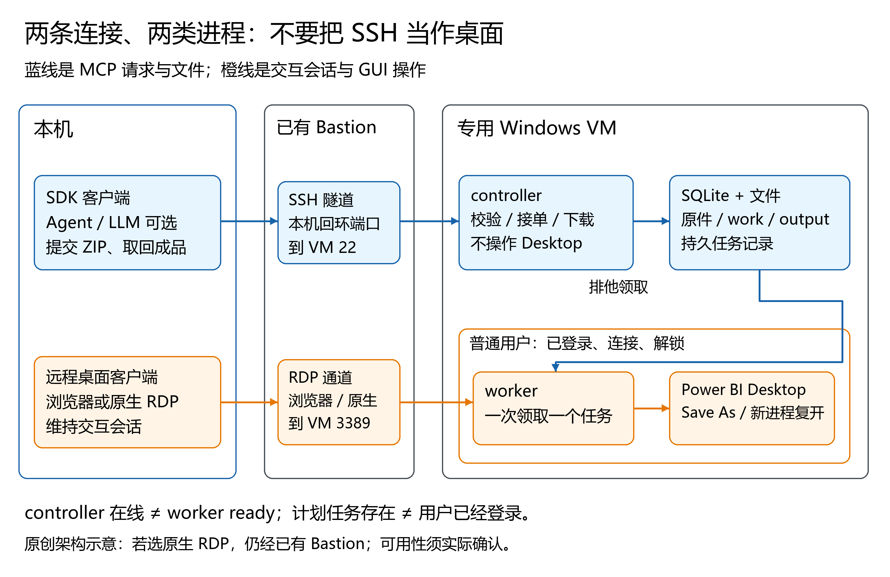

图 3：SSH 运维路径的展开图，对应本节身份表中的管理员入口。蓝色是命令和文件通道，橙色是交互桌面；沿队列找到真正运行 Desktop 的 worker。普通用户按公网网关路径访问，不通过共享这条 SSH 运维身份接入。

通用本机启动默认仍是回环模式；公网部署使用显式批准的 HTTPS origin 和私网绑定，不能把旧回环启动命令当成当前公网服务配置。独立 stdio controller 不监听端口。旧本机 `127.0.0.1:8767` 转发仅属维护方案，不是当前用户入口；企业 SSO、可信代理边界和跨安全域隔离仍需按目标组织设计。可复用配置见[网关部署入口](../deploy/public-gateway/README.md)。

### 3.2 输入不被改写，任务有自己的生命周期

每次提交产生独立任务 ID，并记录所有者、转换方向和导出模式。网页“我的任务”只列当前用户的记录；知道另一人的 ID 也不能查询、取消或下载，未授权请求统一按 `JOB_NOT_FOUND` 拒绝。管理员的显式管理权限与普通用户视图分开。即使两次提交相同文件，也仍是独立任务。

每个任务保存自己的 ZIP 或 PBIX 原件，Desktop 只处理工作副本。反向另存后，服务按工程引用白名单收集报表、模型及允许的资源，再建立独立副本用于复开；definitions 剔除缓存，portable 仅带本任务缓存。本机设置、凭证、其他任务文件都不属于导出物。正常完成或失败后清理临时工作副本，输入、产物与回执按任务留存策略管理；原有历史资料不纳入新任务到期维护。

队列使用本地 SQLite/WAL 持久化保存。WAL 是数据库的一种日志模式；这里最重要的含义是任务不是只放在某个 Python 进程的内存里。客户端断开或者一个 controller 退出，不应使已经接受的任务凭空消失。进程重新连接后仍应按原来的任务 ID 查询，而不是看到终端报错就立刻再提交一遍。

| 状态 | 已经发生的事 | 用户接下来应该做什么 |
|---|---|---|
| `queued` | 原件与队列记录已保存，尚未领取 | 等待、查询，或在领取前取消 |
| `running` | 唯一 worker 已领取，正在操作自己的 Desktop | 等待阶段结果；不要干预转换窗口 |
| `succeeded` | 对应方向/模式的保存、结构检查和新进程复开完成 | 下载 PBIX 或 PBIP ZIP 与验证 JSON |
| `failed` | 输入接受后出现明确执行错误、超时或中断 | 保留错误与原件，修复前提，再提交新任务 |
| `cancelled` | 排队阶段被取消，未进入正常转换 | 不会有成功产物；确需执行时重新提交 |

worker 排他锁与事务领取共同保证队列中同时只有一个任务操作 Desktop，进程隔离则限定它能控制的窗口。取消工具只处理排队任务；一旦任务被领取，就由 worker 完成保存或报告执行错误，避免在写入文件时被任意打断。

多人排队不等于多个 Desktop 同时转换，也不等于不同用户拥有独立 Windows 安全边界。任务所有权保护接口与文件交付，操作系统级隔离需要独立节点或部署。任务的成功状态与产物可下载状态也分开：到期维护后 `artifact_status=expired`，历史成功仍保留，但下载明确返回过期错误。

### 3.3 Save As 之后，为什么还要重新打开

正向转换先打开 PBIP 工作副本。对于精确匹配且没有缓存的可信样例，worker 刷新内嵌数据；其他工程使用已提供的缓存，不执行任意刷新。随后选择本地 PBIX 路径执行 **File → Save as**，核对真实二进制模型、预期页面与视觉对象，不能只有模板式 `DataModelSchema`。

反向转换先检查 PBIX 是支持的本地模型容器，再让 Desktop 真实打开并另存为完整 PBIP，按所选模式打包。受保护、加密、损坏或不支持的格式会被拒绝；遇敏感度标签限制，不移除标签或替用户确认安全提示。单独出现 `SecurityBindings` 包条目并不足以判定有标签，错误应按具体容器或 Desktop 反馈处理。

两个方向都关闭源进程，再由**不同的 Desktop 进程**打开输出 PBIX 或导出工程的独立副本；PID 是区分进程的标识。原窗口显示 60，可能仍来自内存；新进程需要从交付内容恢复。portable 以自己的缓存离线复开，definitions 则检查模型和页面定义，不把空缓存的定义复开写成离线数值成功。

验证信息与成品一起形成产物。网页提供授权文件下载；MCP 客户端通过 `get_artifact` 分块获取，单块不超过 256 KiB，并核对总长度与 SHA-256。SHA-256 是内容摘要，能把服务器和本机文件对应起来，不负责判断业务口径。网页与同身份 HTTP MCP 已取得同一任务的相同文件；两次独立 Save As 的二进制则不要求完全相同。持续下载通过租约保护，避免留存维护在传输中删除文件，第 7.3 节说明其生命周期。

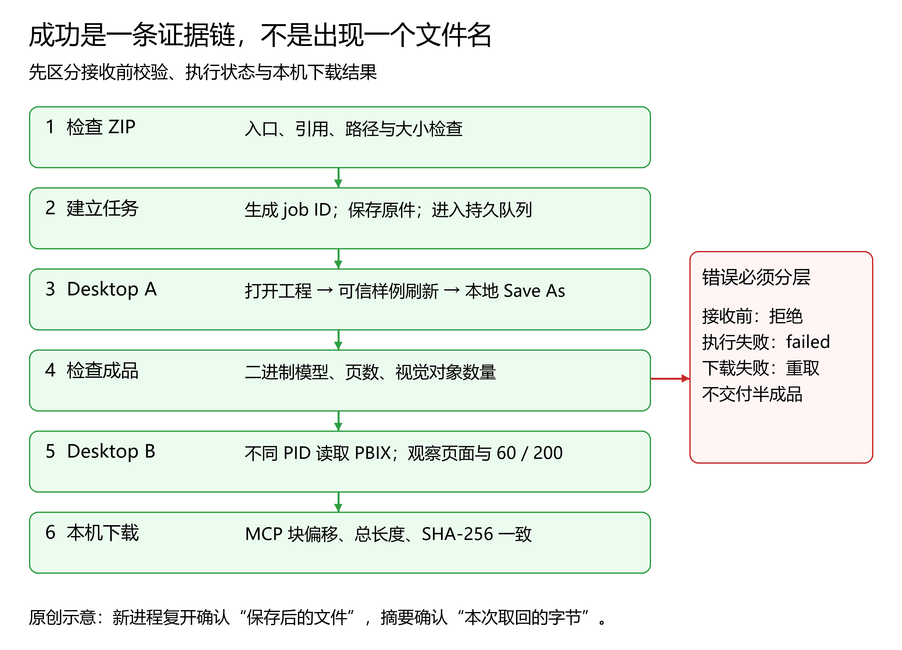

图 4：正向 ZIP → PBIX 的保存检查链。绿色路径逐门向前；反向同样需要真实保存与独立复开，但输出改为 PBIP 工程，数值检查取决于 definitions/portable 模式。下载失败先查原任务，不重新消耗一次转换。

### 3.4 进程和会话边界怎样保护其他工作

Power BI Desktop 依赖正常用户环境与 WebView2，微软明确不支持以系统账户运行。演示环境使用 Windows Server GUI；正式部署应根据厂商明确支持的虚拟桌面条件选择平台，并确认所选操作系统、交互会话方式与自动化运行方式是否在支持范围内，明确平台和应用的支持责任。[2]

管理员负责安装依赖和注册计划任务，转换则放在普通用户的交互会话中。SYSTEM 是系统账户，Session 0 是服务使用的非交互会话，二者都不提供本方案所需的普通用户桌面。计划任务使用 **Interactive + Limited**：在该用户已经登录的会话中，以非提升权限运行。没有这个登录，注册任务本身不会创建可用桌面。[8]

worker 只处理自己启动、确认属于本任务的进程和窗口。Windows Job Object 是管理一组进程的操作系统机制，本实现用它约束自有进程树，清理时不影响其他 Desktop。未知登录、法律或安全提示需要人的判断，worker 会报错而不是自动确认；失败任务保留原件和诊断，供修复原因后重新提交。

公网 portal 则由 `PBIPMCP-PublicPortal` 计划任务承载，使用 `pbipdemo` 的 **Interactive + Limited** 身份并在该用户登录时触发。它不随本机 SSH 终端退出而消失，但仍依赖 Windows 登录；注销后会失去运行前提。portal 在线时 worker 可以离线，两个任务的职责、状态和停止入口保持独立。

## 第 4 章 动手之前：环境、权限与三个执行位置

### 4.1 把 Azure 名词和你要做的事对应起来

Azure **租户**主要是身份目录边界：谁能登录、属于哪个组织；**订阅**主要是资源管理与计费边界；**资源组**把本次 VM、网络等资源组织在一起。VM 是真正运行 Windows、Python 和 Desktop 的机器，Bastion 是到这台机器的受控连接入口。不要因为这些名字都出现在一个门户里，就认为它们是同一种权限。

下面的管理员操作复用 Azure 全球云 Japan West 环境。准备时分别确认公网网关、VM 电源、桌面、worker 和 portal；网页能登录，worker 仍可能离线。普通用户只需 HTTPS 入口和自己的凭证，不承担 VM 运维。

| 环境项 | 演示环境配置 | 对操作的影响 |
|---|---|---|
| Windows | Windows Server 2022，Desktop Experience/GUI | 具有桌面界面；正式部署需评估第 3.4 节的 Desktop 支持条件 |
| Power BI Desktop | 标准版 x64，2.157.1354.0 | 菜单、对话框和文件格式受版本影响；不是 Report Server 优化版 |
| 转换服务 | 0.2.3，推荐 rc6 部署包 | 包含公网客户端与持久门户管理；场景回执保留各自实际运行版本 |
| Python | 3.12.10 x64 | 运行 controller、客户端与 worker |
| MCP / pywinauto | MCP 2.1.1；pywinauto 0.6.9 | 以项目锁定依赖为准，不随意只升级其中一个库 |
| 原生运行库 | Microsoft Visual C++ v14 x64 Redistributable | `win32ui` 等原生模块缺 DLL 时不能靠重试解决 |
| 交互用户 | 专用普通用户 `pbipdemo` | 必须保持真实登录、连接且解锁，不使用个人管理员桌面接单 |
| 显示 | 建议 1600×900 或更高、100% 缩放，英文 Desktop UI | 低分辨率或高缩放可能让关键对话框不可操作 |
| 工作目录 | VM：`C:\PBIPMCP\app`；数据：`C:\PBIPMCP\data` | 管理脚本、任务和 controller 必须指向同一套目录 |
| 公网网页/MCP | App Service HTTPS 根路径及 `/mcp` | 个人身份认证；用户无需本机隧道 |
| 后端网络 | 网关子网 `<GATEWAY_SUBNET_CIDR>` → VM `<VM_PRIVATE_IP>:8765` | NSG/Windows Firewall 限定来源，不开放公网转换端口 |
| portal 运行方式 | `PBIPMCP-PublicPortal`，Interactive + Limited，AtLogon | 独立于本机 SSH，仍依赖专用用户登录 |
| VM 电源策略 | 试用配置已关闭自动关机 | 避免定时中断；不代表桌面解锁或 worker 永久运行，需承担持续成本 |

这些版本构成样例结果的环境基线。Desktop 按月更新，官方只支持最新版本；运行团队应设置兼容性复验和受控更新时间，在新版本上重新检查已支持工程。[2]

Desktop 本地创建和保存这个合成样例，不要求 Power BI 服务登录或 Pro 许可证。在线发布、团队共享、嵌入和消费者访问属于另一套身份、许可证及容量问题；“本地转换不需要 Pro”绝不能推导成“客户的在线报表全部免费”。[2]

### 4.2 三个执行位置，决定命令到底能做什么

普通用户在浏览器里登录、上传和下载，无需 PowerShell、SSH 或 Desktop。以下三个命令执行位置供管理员及获准程序接入者使用；不要把“网页账号”与“VM 普通用户账户”混为一谈。

| 文中标签 | 你在哪里打开 PowerShell | 合适的动作 | 不应该做什么 |
|---|---|---|---|
| 本机 PowerShell | 管理员电脑，或已安装客户端的调用方电脑 | 管理员建隧道；调用方用个人凭证调用 HTTP MCP | 向普通用户分发 SSH 运维密钥 |
| VM 管理员 PowerShell | VM 中提升权限的管理终端 | 安装依赖、配置目录访问权限（ACL）、注册 Interactive 任务 | 从管理员/SYSTEM 环境直接启动 Desktop 转换 |
| VM 普通用户交互 PowerShell | Bastion/RDP 内 `pbipdemo` 的桌面 | 首次 Desktop 准备、人工检查、直接启动交互 worker | 锁定或断开桌面后期待 GUI 自动继续 |

`remote-worker.ps1` 虽然从本机经 SSH 运行管理命令，启动的仍然是已经注册的 Interactive 任务。它不会在 SSH 的非交互会话里直接运行 Desktop，也不会自动登录用户。管理员完成一次注册后，日常操作者只做已授权的启动、停止、状态和诊断；如果新机器没有相应任务权限，需要管理员配置，而不是临时扩大到 Everyone。

### 4.3 连接材料与代码包要先准备完整

使用[rc6 / 0.2.3 源码与部署入口](../README.md)准备项目目录，版本 0.2.3，包含网页、身份、双向转换、持久门户管理、客户端与样例。安装建立运行时及访问控制列表（ACL），限定账户访问。App Service 网关使用[公网网关源码与部署入口](../deploy/public-gateway/README.md)，只代理到已配置的 VM 私网服务；它和 VM 转换包不是二选一。已有运行环境直接进入第 5 章，不必重装。

身份材料分两类。普通用户只获得独立个人访问凭证，用于网页登录或 HTTP MCP；管理员另持 SSH 私钥、已核验指纹的 `known_hosts` 和 VM 连接参数。凭证通过批准的私密渠道分发，在受 ACL 保护的位置保存，不进入工程 ZIP、共享文档或日志。管理命令仅输入路径，不回显秘密内容。

SSH 固定主机指纹的作用是确认隧道另一端确实是预期服务器。连的是 `127.0.0.1` 也不能省掉它，因为回环地址只表示本机入口，不是远端服务器身份。`HostKeyAlias` 让本机不同端口仍使用管理员批准的同一个主机身份；不要为消除警告使用 `StrictHostKeyChecking=no`。

如果需要在新的专用 VM 安装，下面是项目已有安装入口，**只在授权的新环境执行一次**，不是每天的启动命令。

执行位置：**VM 管理员 PowerShell**。前提：rc6 包已解压到 `C:\PBIPMCP\app`，Python、Desktop 和原生运行库按本节准备，法律与组织授权已由人确认。

```powershell
C:\PBIPMCP\app\scripts\setup.ps1 `
  -Root C:\PBIPMCP `
  -WorkerUser pbipdemo `
  -PythonExe 'C:\Python312\python.exe' `
  -DesktopExe 'C:\Program Files\Microsoft Power BI Desktop\bin\PBIDesktop.exe'
```

该脚本建立运行时、安装锁定依赖并配置专用目录权限；实际 Python 路径不同就要调整 `-PythonExe`。它还会导入 UI Automation（UIA）及原生控件依赖。UIA 是读取窗口控件、状态和文本的接口，worker 依靠它识别 Desktop 界面。完成安装后，再注册第 5 章的 `PBIPMCP-Worker`；同一数据目录只启用一套 worker 入口。

### 4.4 先把 Desktop 准备成可预测的样子

worker 接受的是一个已经完成首次准备的 Desktop，而不是每次遇到新提示都由脚本替人作决定。需要登录、安全授权、法律声明或组织政策时，由有权操作者处理。菜单语言、预览格式选项、保存入口与显示缩放，都会影响后续能否定位正确控件。

当前 worker 适配英文 UI 和本地 Windows Save As 对话框，因此演示环境关闭了 Desktop 中的 OneDrive/SharePoint 云保存入口。这个设置只服务于本地转换路径。版本更新后选项可能移位或转为正式功能，应以名称、官方说明和兼容性复验为准。[1][3][4]

具体点击顺序见第 5.1 节，由管理员连接桌面后完成。首次部署或更新后需要检查；普通网页用户无需配置这些选项，也不要为了自己的任务改动共享运行节点。

此处需要同时满足“人已完成必要提示”和“程序报告 ready”。前者解决 Desktop 的第一次交互，后者解决 worker 是否真的运行在可用会话。仅检查其中一个，容易把失败留到提交之后才发现。

## 第 5 章 从网页登录到取回成品，再看管理员怎样准备环境

已有服务时，用户从下方网页流程开始。第 5.1—5.7 节另给管理员完整的桌面准备与 SSH 运维路径，保留第一次部署和故障恢复时需要的细节。两条路径共用同一 worker，不需要普通用户先学 SSH，也不能由每个网页用户各启动一份 Desktop。

### 已有服务：从选择文件到一次往返

访问 `https://pbip-mcp-bidir-2d79425f.azurewebsites.net/`，将管理员分配的个人访问凭证填入登录框并登录。无需在自己的电脑建立隧道。右上角显示身份，右侧“我的任务”仅列自己的记录；节点离线时由管理员恢复桌面与 worker，不因公网网页打开就假定转换已就绪。


先看右上角用户，再看左上角节点状态。画面展示节点离线时的用户入口：任务可先排队，但要等管理员恢复交互节点后才能转换。

手里已有 PBIX 时，点“选择文件”选中经批准的本地 PBIX，转换方向选“PBIX → PBIP工程”或保留自动识别。在“PBIP 工程内容”中，默认“可编辑工程（不含数据缓存）”对应 definitions；需要带着已有数据离线回转时，选择“完整工程（含数据，可用于离线转回）”，即 portable。选择依据是下一步的数据需求，不是文件后缀偏好。

手里已有 PBIP 时，点“选择工程文件夹”，选同时包含入口、Report 和 SemanticModel 的根目录；或用“选择文件”上传完整工程 ZIP。不要只选 `.pbip` 入口，页面会提示缺少完整工程且禁止提交。非内置工程还需满足第 2.3 节的数据缓存条件。


左侧先确认选中的是工程根目录，再看“转换方向”下的目标提示；这是提交前的输入确认，点“提交转换”后才会出现任务。未支持文件夹选择的浏览器可使用完整 ZIP。

提交后在“我的任务”看排队、处理中、完成或失败。一个节点串行处理，多人的请求各自等待；网页刷新或登录过期不会要求重新上传。重新登录同一身份后，先找到原任务；不确定上传是否被接收时，也先刷新列表。仅排队任务可以取消，已经被 worker 领取时应等待结果。

完成后下载“PBIP 工程 ZIP”或“PBIX”，并保留“转换检查记录”。导出的 PBIP ZIP 应完整解压到新的短路径，保持目录关系后打开入口。definitions 先检查模型和页面定义，后续数据加载另行处理；portable 可以用随包缓存检查 60。若要走完往返，把刚取得的 portable ZIP 再作为新输入，目标选 PBIX，得到独立任务与新成品。


右侧“完成”对应本任务，下面的两个入口分别下载成品和检查记录。这里展示的是 PBIP → PBIX；反向任务的成品入口为 PBIP 工程 ZIP。下载中断可回到同一任务重取，不必重新转换。

公网示例把两个入口连成一条文件路径：普通用户在网页上传 `Synthetic.zip`，取得新进程显示 60 的 PBIX，再用同一用户通过公网 MCP 将**刚下载的那份 PBIX**导出 portable 工程。反向不刷新数据，新进程仍显示 60；所得 ZIP 既可从网页下载，也可由同身份 MCP 取回。


先看下方工程转 PBIX 的任务，再看上方以该 PBIX 为输入的 portable 导出。方向、数据模式和下载入口分别对应两个独立结果。数值与新进程由各自的转换检查记录说明，页面上的“完成”则用于找到原任务及成品。

下载到本机后按约定位置保存，不覆盖已有交付；使用结束点击右上角“退出”。退出网页不停止其他人的任务或节点。更细的普通用户操作和管理员入口见[日常运行手册](02-日常复跑与运维.md)；下面进入管理员的环境准备与命令式路径。

### 5.1 管理员第一步：恢复用户桌面，不只是 VM 电源

本例使用 Azure 全球云门户 `https://portal.azure.com`。管理员从 **Virtual machines/虚拟机**列表选择已有 VM，先看 **Overview/概览**的实际电源状态，关机后按授权恢复。**Operations → Auto-shutdown/自动关机**在当前试用配置中为 Disabled，以免定时中断持续试用；这不会自动登录、解锁桌面或让 worker 永不退出。重新启用定时关机应另行获得运行窗口与成本安排。

如果桌面已经连接，且 Desktop 已完成首次设置，保留当前会话并继续第 5.2 节；新环境则完成下方的应用准备后再继续。确认的是可操作的 Windows 桌面，而不只是一个打开的浏览器标签。

从 **Connect → Bastion** 进入连接页，选择 RDP、端口 3389、VM Password 方式登录专用普通用户。用户名和密码由操作者在获准页面填写。

在 Bastion 连接表单先确认 RDP 和端口 3389，再填写批准的桌面账户。公开版不附认证表单截图。这条连接承载交互桌面，稍后的 MCP 命令通道另用 SSH 22 端口。

连接后应看到 `pbipdemo` 的 Windows 桌面，而不是锁屏、登录页或断线对话框。若只是网页标签打开了但桌面没有出现，还不能继续。保持这条会话连接且未锁定；转换期间不要切进 worker 的 Desktop 窗口修改报表、拖动弹窗或手动另存为，否则你正在改变它执行中的环境。

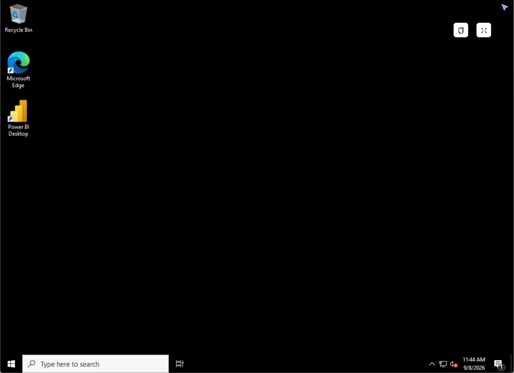

图 6：连接成功后应进入 Windows 桌面，左侧可找到 Power BI Desktop 入口。首次准备从这里打开应用；接单状态稍后由 Doctor 和 worker 心跳确认。

如果这是一次断线后的重新连接，也应先回到同一个批准用户的正常桌面，再恢复命令通道与 worker。

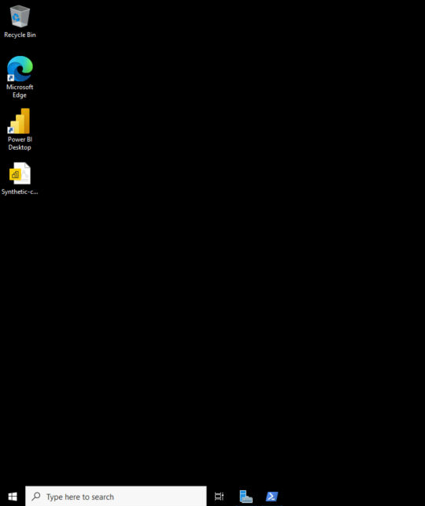

图 7：恢复连接后的桌面。确认画面不再停在锁屏或连接错误页，然后按第 5.4 节核对 Active 用户会话与 worker 状态。

**连接后首次准备：只在新环境或版本变化时执行。** 在 VM 普通用户桌面打开 Desktop，由人处理必要的首次提示，然后到 **Help → About** 读取版本，与第 4.1 节的环境基线对照；版本不同，应先安排兼容性复验。

进入 **File → Options and settings**，单击右侧 **Options**。不要误选下面的 Data source settings：后者用于数据源连接，不是设置项目格式和保存入口。

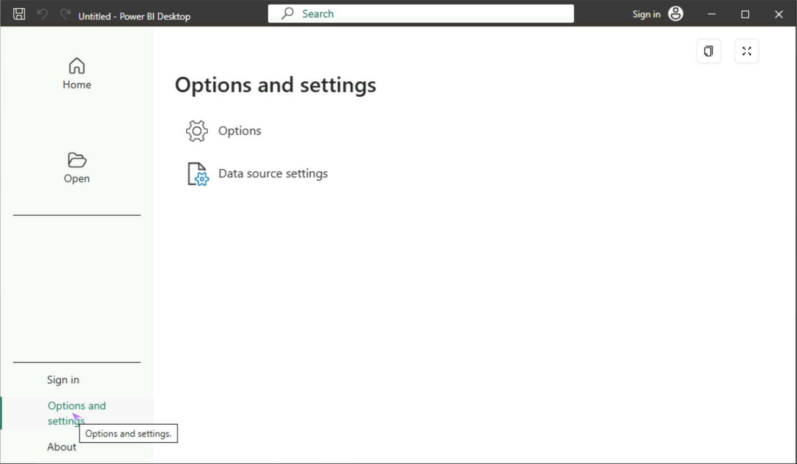

图 8：左侧选择 Options and settings，右侧进入带齿轮的 Options。随后在 GLOBAL 下查找预览功能。

在 Options 左侧 **GLOBAL → Preview features** 中，找到 **Save to OneDrive and SharePoint**，取消勾选。演示版本把它放在 Preview features，而不是 Save and Recover 中。关闭该入口后，worker 才会遇到已适配的本地 Windows Save As 对话框。

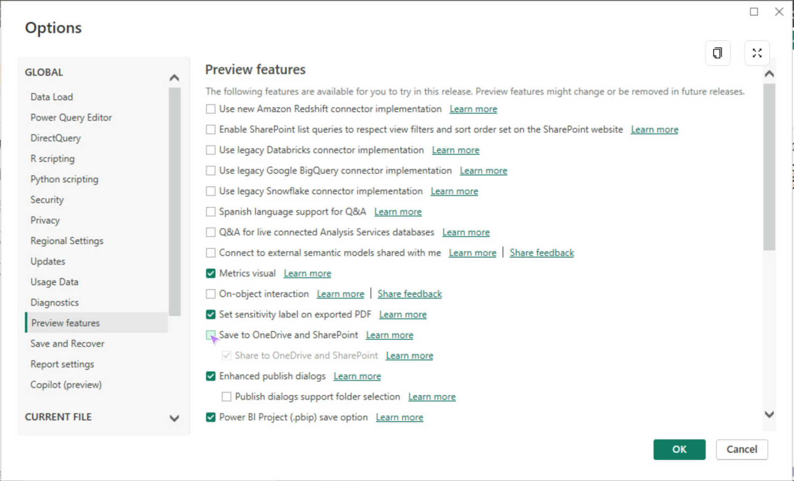

图 9：中下部的 Save to OneDrive and SharePoint 未选中，下方 Share 项随之灰显；底部 PBIP 保存选项仍保留。这样调整的是保存入口，不是关闭工程格式。

继续在同一个 Preview features 列表中向下查看，确认 **Power BI Project (.pbip) save option**、**Store semantic model using TMDL format** 和 **Store reports using enhanced metadata format (PBIR)**。演示环境还开启了 **Store PBIX reports using enhanced metadata format (PBIR)**，对应保存后 PBIX 中的增强报表格式。[1][3][4]

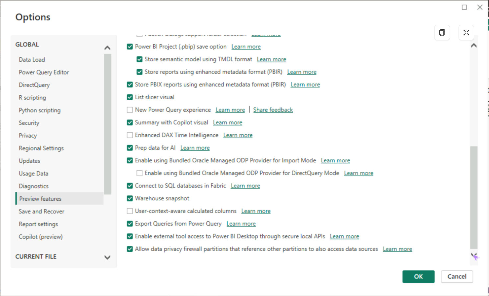

图 10：关注与 PBIP、TMDL、PBIR 及 PBIX 增强格式有关的四项。图中其他功能保持你的组织配置；新版若已将某项转为正式功能，按该版本的说明检查，而不是追求相同勾选画面。

单击 Options 的 OK 后，如果出现 **Feature requires a restart**，先处理未保存内容，再重启 Desktop，使设置生效。

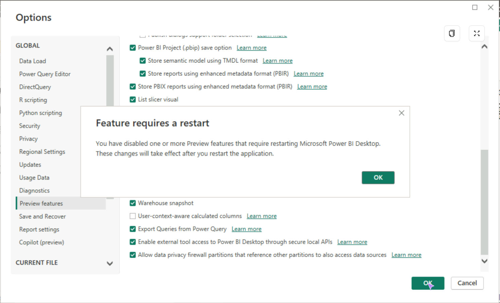

图 11：中央提示说明设置需要重新启动应用后生效。这是配置流程的提示，处理完重启后再交给 worker 接单。

准备完成后关闭人工打开的 Desktop 窗口，后续转换由 worker 启动自己的进程。已经具备这些设置的环境直接继续，不必重复配置。

VM 电源、Windows 登录和 Desktop 初次准备是三层独立状态；每层都就绪后，下一步的状态查询才有意义。

### 5.2 管理员第二步：在本机建立一套可复用参数

**先取材料。** 将[rc6 / 0.2.3 源码与部署入口](../README.md)解压到桌面的新项目文件夹，示例使用 `powerbi-pbip-pbix-mcp-demo`；顶层应看到 `pyproject.toml`、`scripts`、`sample` 和 `src`。已有部署沿用经过核对的 0.2.3 目录；同名目录有其他内容时选择新目录并调整路径，不直接覆盖。

**部署包和转换输入不是同一个 ZIP。** rc6 外层包用于部署代码；提交给 `submit_project` 的首个输入是包内 `sample\Synthetic.zip`，富样例用 `sample\Rich.zip`。导出的 `.pbip.zip` 也可作为工程输入，但必须完整保留所选模式的目录与缓存。

在本机打开两个 PowerShell 终端。**终端 A**专门维持隧道，不关闭；**终端 B**负责身份确认、worker 管理与 MCP 客户端。这样，长驻隧道不会占住你需要输入后续命令的终端。

已有本机 `.venv` 的用户直接执行下面的连接参数块。新本机若只有源包，先在 **本机 PowerShell、项目根目录**按项目已有方式初始化；前提是本机具备批准的 Python 3.12 x64。不要为了每天运行反复安装：

```powershell
Set-Location -LiteralPath (
  Join-Path ([Environment]::GetFolderPath('Desktop')) 'powerbi-pbip-pbix-mcp-demo'
)
python -m venv .venv
.\.venv\Scripts\python.exe -m pip install -r requirements.lock
.\.venv\Scripts\python.exe -m pip install --no-deps -e .
```

这是准备客户端依赖，不是在本机运行 Desktop 转换。包源访问失败要修复批准的包源或代理，不随意换库版本。项目解压位置不同，先调整 `Set-Location`；下面示例约定项目文件夹直接放在当前用户桌面。

在**本机 PowerShell 终端 B**建立连接参数。前提：项目目录及 `.venv` 已经存在；SSH 私钥和指纹文件由管理员提供。输入的是文件路径，不是私钥文本。

```powershell
$Desktop = [Environment]::GetFolderPath('Desktop')
$Project = Join-Path $Desktop 'powerbi-pbip-pbix-mcp-demo'
Set-Location -LiteralPath $Project
$Python = Join-Path $Project '.venv\Scripts\python.exe'
if (-not (Test-Path -LiteralPath $Python -PathType Leaf)) {
  throw 'Missing local runtime. Complete the approved project setup first.'
}
$Identity = Read-Host 'Path of the approved SSH private-key file'
$KnownHosts = Read-Host 'Path of the pinned known_hosts file'
$HostKeyAlias = Read-Host 'Host alias approved with the pinned fingerprint'
$Port = 50027
foreach ($Path in @($Identity, $KnownHosts)) {
  if (-not (Test-Path -LiteralPath $Path -PathType Leaf)) {
    throw "Required identity file is missing: $Path"
  }
}
$WorkerConnection = @{
  Port = $Port
  Identity = $Identity
  KnownHosts = $KnownHosts
  HostKeyAlias = $HostKeyAlias
}
$McpConnection = @(
  '--port', [string]$Port,
  '--identity', $Identity,
  '--known-hosts', $KnownHosts,
  '--host-key-alias', $HostKeyAlias
)
```

这个代码块只建立本机变量和检查文件存在，不会复制密钥到 VM，也不会创建云资源。后文的 `@WorkerConnection`、`@McpConnection` 就是展开这组参数；如果重开终端 B，需要先重新运行本节，而不是假设变量跨终端存在。

本文统一使用本机端口 **50027**。若被占用，选择空闲端口后同时修改终端 A 与 B；隧道监听端口与客户端连接端口必须一致。只管理自己建立的通道，不停止其他人的端口进程。

### 5.3 第三步：保持 Bastion 隧道，并确认真正连到了 VM

执行位置：**本机 PowerShell 终端 A**。前提：本机 Azure CLI 已通过组织批准的流程登录目标租户，现有 Bastion 为支持原生隧道的 SKU 且已启用相应功能。官方要求这类原生客户端连接使用 Standard 或更高 SKU；已有门户 RDP 能用，并不能推导 SSH 隧道一定已配置。[9]

资源名与 ID 由管理员提供或从已授权资源概览复制，按下表填写隧道参数。

| 参数 | 到哪里取 | 容易混淆的地方 |
|---|---|---|
| BastionName | 已有 Bastion 资源的 Overview 名称 | 不是 VM 的名称 |
| ResourceGroup | Bastion 资源所在的资源组 | 不应凭 VM 名字猜；跨组部署时尤其要分清 |
| VmResourceId | VM 概览的 JSON View/资源 JSON 中的完整资源 ID | 不是显示名称，也不是 Power BI 任务 ID |
| Subscription | 本次已有资源所在的批准订阅 | 使用与该环境一致的登录上下文，不借用别的租户凭据 |

```powershell
$BastionName = Read-Host 'Existing Bastion resource name'
$ResourceGroup = Read-Host 'Existing Bastion resource group name'
$VmResourceId = Read-Host 'Existing VM resource ID'
$Subscription = Read-Host 'Approved subscription ID'
$Port = 50027
az network bastion tunnel `
  --name $BastionName `
  --resource-group $ResourceGroup `
  --target-resource-id $VmResourceId `
  --resource-port 22 `
  --port $Port `
  --subscription $Subscription `
  --only-show-errors
```

这个命令保持运行，建立到 VM SSH 端口的通道；不要等它“正常结束”再运行终端 B。若它马上退出、提示授权错误或端口占用，先修复该层，不提交转换。曾给其他租户设置过环境凭据的专用终端，应由操作者核对并清理冲突的 `AZURE_*` 环境配置，不把别的应用秘密整份转发给 MCP 客户端。

回到**本机 PowerShell 终端 B**，使用刚才的变量执行一个最小身份确认：

```powershell
$SshOptions = @(
  '-T', '-p', [string]$Port, '-i', $Identity,
  '-o', "UserKnownHostsFile=$KnownHosts",
  '-o', "HostKeyAlias=$HostKeyAlias",
  '-o', 'StrictHostKeyChecking=yes',
  '-o', 'IdentitiesOnly=yes',
  '-o', 'BatchMode=yes',
  '-o', 'ConnectTimeout=45',
  '-o', 'ServerAliveInterval=15',
  '-o', 'ServerAliveCountMax=3'
)
ssh @SshOptions pbipdemo@127.0.0.1 whoami
if ($LASTEXITCODE -ne 0) {
  throw 'SSH identity check failed. Do not submit a conversion.'
}
```

响应应为批准的机器名加 `\pbipdemo`。`BatchMode=yes` 使缺少正确身份时明确失败，而不是等待密码输入。主机指纹不一致时，应核对服务器是否被替换或隧道是否指错目标，不要关闭指纹校验。

若本机端口仍监听，但 SSH 提示 `banner exchange` 超时，可能是通道失效而非 Python 错误。只停止自己终端 A 中的隧道，再按同一批准配置重建，重新得到 `whoami` 响应后才继续。把超时时间无限加长不会修复失效连接。

### 5.4 第四步：准备完整输入，启动正确的 worker

先使用随包提供的 `sample\Synthetic.zip`，这样模型、报表和自动刷新资格都与已知基线一致。需要观察工程内容时，在本机项目的 `sample\Synthetic` 目录查看 `.pbip`、`.Report` 和 `.SemanticModel` 三部分；不要只把入口文件压缩，也不要把本机 `.venv`、SSH 文件或整个桌面打包。

下图展示同包第二个样例 `Rich` 的完整目录；它与基线采用相同的“入口＋报表＋模型”结构，只是入口名称包含中文、空格和 Ω。首次运行仍按上文提交 `Synthetic.zip`，不因这张目录图而切换输入。

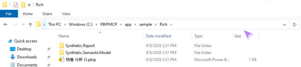

图 12：展开的 Rich 工程中，入口 `销售 分析 Ω.pbip` 与 `Synthetic.Report`、`Synthetic.SemanticModel` 并列。检查自己的包时，也要沿入口找到对应报表和模型，不能只发送入口文件。

执行位置：**本机 PowerShell 终端 B**。先设置输入路径，再查看工程目录与 ZIP：

```powershell
$InputZip = Join-Path $Project 'sample\Synthetic.zip'
Get-ChildItem -LiteralPath .\sample\Synthetic
Get-Item -LiteralPath $InputZip |
  Select-Object Name, Length, LastWriteTime
```

如果你是从源包恢复了样例目录但没有对应 ZIP，使用项目已有的生成器重新建立一个**新名字**的完整样例，而不是手工猜内部文件。以下是可选准备动作，不需要与已有 `Synthetic.zip` 同时执行：

执行位置：**同一个本机 PowerShell 终端 B、项目根目录**。可选生成分支会将 `$InputZip` 改为新 ZIP，后续首次转换使用这个路径。

```powershell
$SampleTag = (Get-Date).ToUniversalTime().ToString('yyyyMMdd-HHmmss')
$InputZip = Join-Path $Project "sample\Synthetic-$SampleTag.zip"
& $Python -m pbip_mcp.synthetic `
  --directory ".\sample\Synthetic-$SampleTag" `
  --zip $InputZip
if ($LASTEXITCODE -ne 0) { throw 'Sample generation failed; do not submit.' }
```

这会生成等价的内置文件内容，ZIP 时间戳可使压缩包摘要不同。不要用“和上次 ZIP 摘要不同”就判定刷新白名单失效：白名单检查的是实际文件集合和内容，而不是依赖上传者提供的标签。若你改过其中一个文件，则不再是同一个可信样例。

首次部署时，由**VM 管理员 PowerShell**注册一次连续 worker：

```powershell
C:\PBIPMCP\app\scripts\manage-worker.ps1 `
  -Action Register `
  -Root C:\PBIPMCP `
  -WorkerUser pbipdemo
```

已有 `PBIPMCP-Worker` 的环境跳过注册。`ReviewSeconds` 控制流程中供观察界面的停留时间，新注册默认不额外停留；现有演示环境为 20 秒。日常 Start 会读取并保留已注册参数，显式传入不一致的配置会被拒绝，因此不要在启动时顺手改成另一套值。

现在在**管理员本机 PowerShell 终端 B**执行日常管理入口：

```powershell
.\scripts\remote-worker.ps1 @WorkerConnection -Action Doctor
.\scripts\remote-worker.ps1 @WorkerConnection -Action Start
.\scripts\remote-worker.ps1 @WorkerConnection -Action Status
```

`Doctor` 检查 Python、Desktop 安装、UIA/原生模块、数据目录、磁盘和 worker 心跳，不启动 Desktop。它的环境检查通过，只表示依赖基本齐备。真正可继续提交的信号是 **`worker.ready=true`**，不是仅看计划任务显示 `Running`，也不是看 SSH 调用者的 Session ID。ready 表示交互条件可用，不保证此刻空闲；状态为 busy 的健康 worker 也可以 ready，新请求进入队列等待。

从 SSH 执行 Doctor 时，`caller_session` 显示 Session 0 可以是正常现象：这里的“调用者”是管理命令，不是实际转换进程。若独立的 worker 在普通用户交互会话中 ready，就不应为了把这个字段改成非零而把整个控制端挪到桌面上。

下面两张图使用 **VM 管理诊断 PowerShell** 中的等价本地入口。图中 Administrator 标题属于管理终端；转换仍由已注册的 `PBIPMCP-Worker` 以 **Interactive + Limited** 运行。管理命令的会话与权限，不改变转换任务的主体。

执行位置：**VM 管理诊断 PowerShell**。需要在 VM 本地排查时使用以下替代入口；本机管理脚本已经得到 ready 时，可跳过并继续提交。

```powershell
Set-Location C:\PBIPMCP\app
whoami
query user
.\scripts\manage-worker.ps1 -Action Doctor |
  ConvertFrom-Json | Format-List
.\scripts\manage-worker.ps1 -Action Start
.\scripts\manage-worker.ps1 -Action Status |
  ConvertFrom-Json | Format-List
```

先读 `whoami` 和 Active 用户会话，再看 Doctor 的依赖检查与 worker ready/idle。`caller_session` 描述当前管理终端；实际能否接单看 worker 字段。自己的身份诊断保留在运行环境，不上传共享仓库。

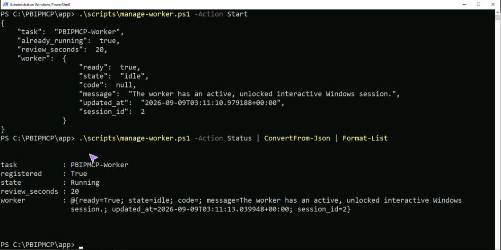

图 14：Start 返回 `already_running=true`，表示复用已运行的 worker；Status 中继续检查 ready/idle 以及已注册的 `review_seconds`。任务 Running 与 worker 就绪应一起看。

如果 Start 报任务不匹配，它可能属于不同用户、目录或执行程序，应停下找管理员核对。脚本拒绝覆盖是保护已有任务，不是要求你删除同名任务再赌一次。若报 notready，回到 Bastion 确认用户连接且解锁，再查看 `runs\worker-*` 日志；不要从 SSH 直接启动 `pbip_mcp.worker` 来绕过会话检查。

### 5.5 第五步：用 SSH 运维客户端提交并取回结果

执行位置：**本机 PowerShell 终端 B**，保留本章的连接变量。使用时间戳生成一组新文件名；客户端还会在提交前拒绝已有输出。

```powershell
$Stamp = (Get-Date).ToUniversalTime().ToString('yyyyMMdd-HHmmss')
$Prefix = Join-Path $Desktop "PBIP-MCP-FirstRun-$Stamp"
& $Python .\scripts\run-remote-demo.py @McpConnection `
  --zip $InputZip `
  --output "$Prefix.pbix" `
  --verification "$Prefix.verification.json" `
  --result-json "$Prefix.e2e.json" `
  --timeout 900 `
  --wait-ready 30
if ($LASTEXITCODE -ne 0) {
  throw 'Client failed; inspect the receipt and original job ID before retrying.'
}
$Result = Get-Content -LiteralPath "$Prefix.e2e.json" -Raw | ConvertFrom-Json
if (-not $Result.ok -or $Result.job.status -ne 'succeeded') {
  throw 'The receipt does not confirm a successful conversion.'
}
```

`--wait-ready 30` 是提交前等待 worker 的有限时间；`--timeout 900` 是客户端等待任务的上限，单位均为秒。服务端单次转换仍有自己的 600 秒上限，修改客户端等待值不会把 Desktop 运行时间变成无限。

客户端先检查目标名、确认 ready，再提交 ZIP。终端会输出 `submitted` 事件与 `job_id`，随后在状态变化时输出 `job_status`。有时 worker 领取得很快，你未必看到每个中间状态的逐帧打印；判断以持久任务记录为准，不要求终端一定先展示某一行才算正确。

远端此时由 worker 打开工程、刷新可信样例并执行本地 Save As。可以在 Bastion 中观察，但不要修改保存路径或操作弹窗，以免改变正在执行的流程。未知对话框会使任务明确失败并留下诊断，处理方法见第 8 章。

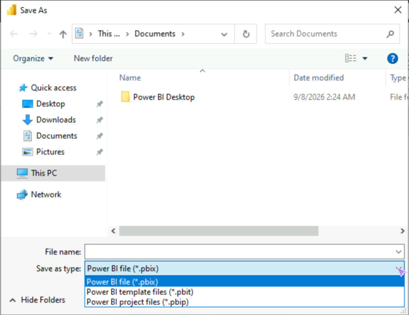

图 15：在 Save as type 中识别 **Power BI file (*.pbix)**，不要选成模板 PBIT 或工程 PBIP。图示文件名尚未填写；执行转换时，worker 会使用自己的任务输出路径，随后核对实际文件。

命令完成后，先读 `.e2e.json` 的 `ok` 和 `job.status`。返回码非零或 `ok=false` 都应检查 `error.code`；不要因为目录中已经有某个文件，就忽略后续复开或下载失败。记录了任务 ID 的客户端超时，尤其不能立刻重提：任务可能仍在运行，应按第 7 章查询原 ID。

### 5.6 第六步：把“服务器说成功”和“我拿到了成品”对应起来

成功时桌面得到三个文件，各有用途。PBIX 是要交给 Desktop 的成品；`verification.json` 说明保存结构和新进程复开证据；`e2e.json` 把一次客户端调用的任务、下载和错误信息串起来。单次客户端已经核对文件长度与 SHA-256，操作者仍可用下面命令定位并查看。

执行位置：**本机 PowerShell 终端 B**，`$Prefix` 仍是本次唯一输出前缀。

```powershell
Get-Item -LiteralPath "$Prefix.pbix",
  "$Prefix.verification.json", "$Prefix.e2e.json" |
  Select-Object Name, Length, LastWriteTime
Get-FileHash -LiteralPath "$Prefix.pbix" -Algorithm SHA256
Get-Content -LiteralPath "$Prefix.verification.json" -Raw
```

这里应看到 `converter` 为 `power-bi-desktop-ui`、`reopened_in_fresh_desktop` 为 `true`，以及不同的源进程和复开进程标识。再用 `synthetic_total_amount` 中的 60 对应基线结果。

下面的查询图展示已完成任务的状态和回执。若需要在 VM 侧排查“服务器已成功，但本机未拿到文件”，可查询原任务并下载回执副本；下方命令通过接口获取，不依赖新旧存储目录的差异。正常转换已经取回回执时无需重复此步骤。

执行位置：**VM 管理诊断 PowerShell**，项目目录 `C:\PBIPMCP\app`。输入此前保留的任务 ID：

```powershell
Set-Location C:\PBIPMCP\app
$Job = Read-Host 'Previously recorded job ID'
$r = .\.venv\Scripts\python.exe -m pbip_mcp.client `
  --data-dir C:\PBIPMCP\data job --job-id $Job |
  ConvertFrom-Json
$r.job | Format-List job_id,status,finished_at
$r.job.artifacts | Format-Table kind,bytes,sha256 -AutoSize
$Tag = (Get-Date).ToUniversalTime().ToString('yyyyMMdd-HHmmss-fff')
$VerificationPath = "C:\PBIPMCP\runs\inspection-$Tag.verification.json"
.\.venv\Scripts\python.exe -m pbip_mcp.client `
  --data-dir C:\PBIPMCP\data download --job-id $Job `
  --kind verification --output $VerificationPath
if ($LASTEXITCODE -ne 0) { throw 'Cannot retrieve this task verification; inspect its state.' }
Get-Content -LiteralPath $VerificationPath |
  ConvertFrom-Json |
  Format-List desktop_pid,reopened_pid,synthetic_total_amount,
    reopened_in_fresh_desktop
```

成功后的只读查询，先看任务 `succeeded`，再看源进程与复开进程不同、`reopened_in_fresh_desktop=True` 和卡片 60；产物元数据用于与本机下载文件对应。公开[样例 verification](../examples/README.md)保留复开与观测字段，内部任务 ID 和 PID 不公开。

在自己的下载目录中，找到 PBIX 后，用相同文件名前缀定位 verification 和调用结果；按权限一起保留，便于追溯转换与下载。内部命令画面和原始调用回执不附在公开版中。

worker 的新进程复开在 VM 中完成，基线核对 `Synthetic overview` 页、`Sales`、`Total Amount` 和卡片 60。若改跑 `Rich.zip`，则按第 6 章看两页、5 个视觉对象和 60/200。你也可以在装有兼容 Desktop 的本机打开 PBIX，检查最终接收环境中的呈现；仅调用 MCP 和下载文件不需要本机安装 Desktop。

### 5.7 第七步：停止接单，然后再断开连接

仅在管理员结束批准的服务窗口时执行：先协调停止提交，确认没有待处理请求或持续下载并停妥 portal，再让 worker 退出。执行位置：**本机 PowerShell 终端 B**；普通用户退出网页不执行这一段。

```powershell
.\scripts\remote-worker.ps1 @WorkerConnection `
  -Action Stop -WaitSeconds 30
.\scripts\remote-worker.ps1 @WorkerConnection -Action Status
```

Stop 写入停止请求，在当前转换结束后生效，不强杀正在保存的 Desktop。30 秒内没有停完会明确报告仍在等待；这时保留桌面和隧道，按需要使用更长的有界等待，而不是把终端错误理解成“已经强制停止”。任务本来已停止时会返回 `already_stopped=true`。

worker 停妥后再关闭自己的通道并退出其 Bastion 桌面，具体终端顺序见运行手册管理员部分。停止通道**不会释放 VM、磁盘或 Bastion**，资源保留由负责人处理，成本见第 10.2 节。

## 第 6 章 从一个卡片扩展到多页、关系与连续任务

本章在同一套环境中改变输入。网页用户沿用自己的登录；管理员若已按第 5.7 节收尾，先按[运行手册管理员部分](02-日常复跑与运维.md)恢复服务。下面 SSH 命令仍使用第 5.2 节终端 B 的变量，不与个人 HTTP MCP 身份混用。

### 从销售 PBIX 导出，再回到 PBIX

基本销售 PBIX 选择 portable 后，Desktop 另存为工程，导出包保留当前任务的模型缓存。在独立副本中重新打开 PBIP，`Synthetic overview` 页显示 60；把这份 ZIP 再提交为 PBIP → PBIX，新成品由另一进程打开仍显示 60。两次转换是独立任务，前一个输出是后一个输入，不共享临时缓存目录。

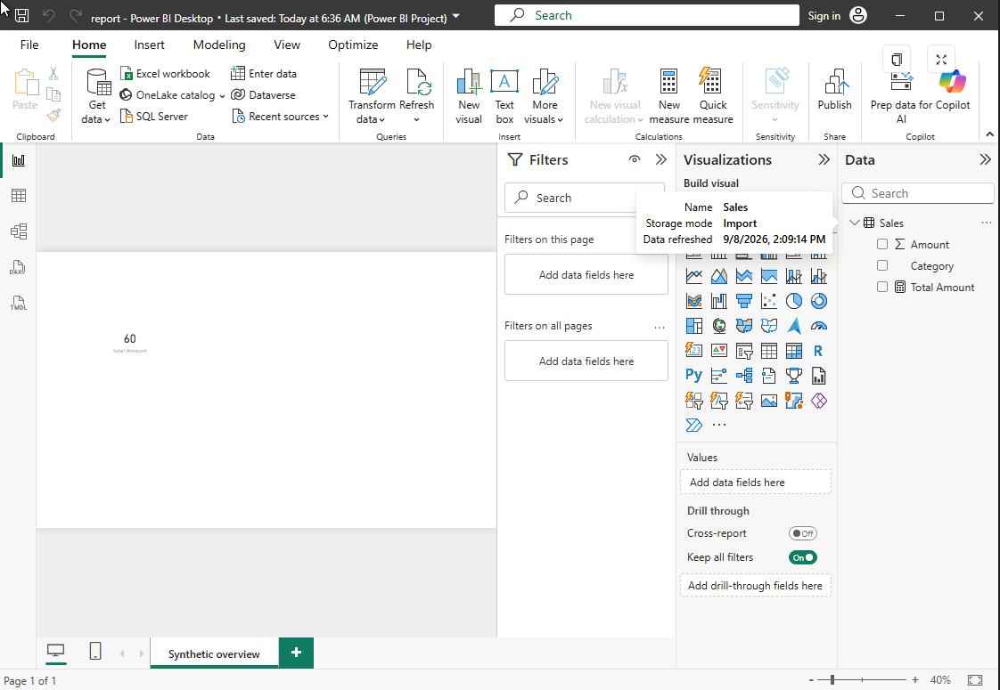

标题栏的 Power BI Project 表示正在读工程，底部是 `Synthetic overview`，卡片为 60。它说明带缓存的工程恢复了该样例的数据与绑定。

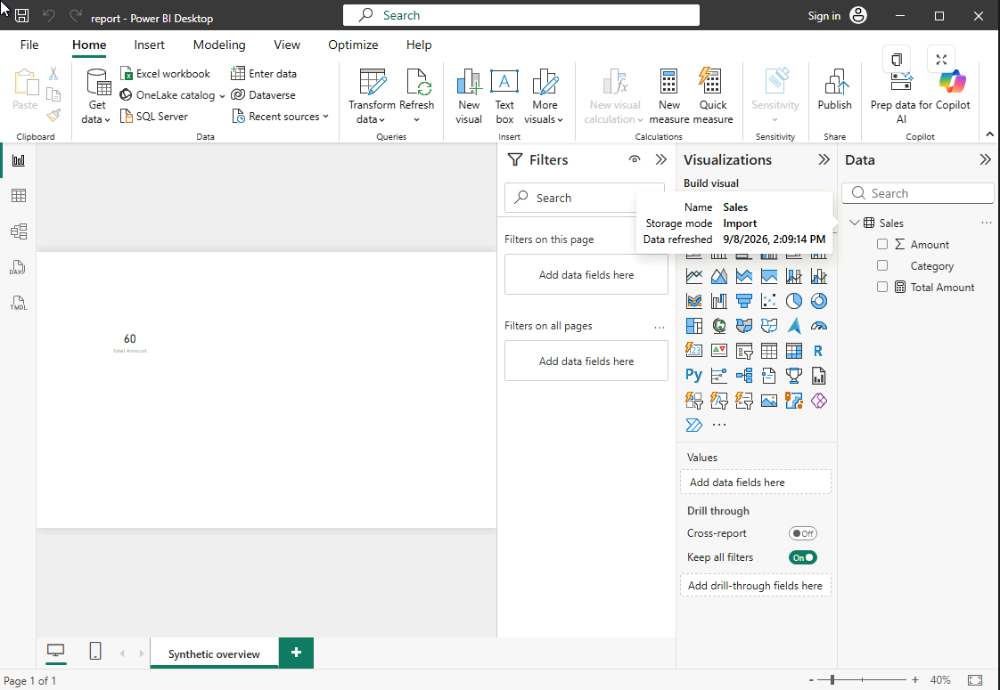

转回 PBIX 后仍读同一个页面和卡片；对照[portable 工程](../examples/Sales-portable-c268.pbip.zip)与[往返成品](../examples/Sales-roundtrip-5a09.pbix)，重点是两端内容而非独立保存文件的二进制是否完全相同。

从同一原 PBIX 选择 definitions 则得到另一种结果：[定义工程](../examples/Sales-definitions-rc4.pbip.zip)不带缓存，独立打开仍保留模型和页面。这里没有离线数值承诺；定义中的内嵌 M 数据仍可能存在，未经数据加载不能把“可编辑”当成“已恢复所有数值”。这条分支适合代码工作流，不能替代 portable 往返。

### 6.1 扩展样例为什么选这几项

最小样例的 60 能发现“只有定义没有数据”，却不能发现第二页丢失、关系没有工作或中文名在传输中改变。因此，扩展样例没有盲目加几百行数据，而是增加几种能区分不同故障的结构。

它含两页中文显示名、5 个视觉对象，覆盖 `card`、`clusteredColumnChart` 和 `tableEx`。入口文件名、页名、维度表、度量值和本机成品名使用中文、空格及 Ω。模型增加 `产品 维度`，通过 `Sales.Category` 连接产品类别；`RELATED` 取得每行的权重，`SUMX` 将各行金额乘权重后求和。

下面是扩展样例内已有的 DAX，仅用于阅读，不是 PowerShell 命令：

```dax
加权 金额 =
    SUMX(
        Sales,
        Sales[Amount] * RELATED('产品 维度'[权重])
    )
```

| 类别 | 原金额 | 权重 | 加权贡献 |
|---|---:|---:|---:|
| A | 10 | 2 | 20 |
| B | 20 | 3 | 60 |
| C | 30 | 4 | 120 |
| 合计 | 60 | 不直接求和 | 200 |

如果关系失效，基本聚合仍可能显示 60，而依赖权重的计算就会暴露问题。因此，200 是新增结构对应的观察点。若工程再加入双向关系、复杂筛选、按用户限制可见行的 RLS（行级安全）或时间智能计算，也需要为这些行为另设预期结果。

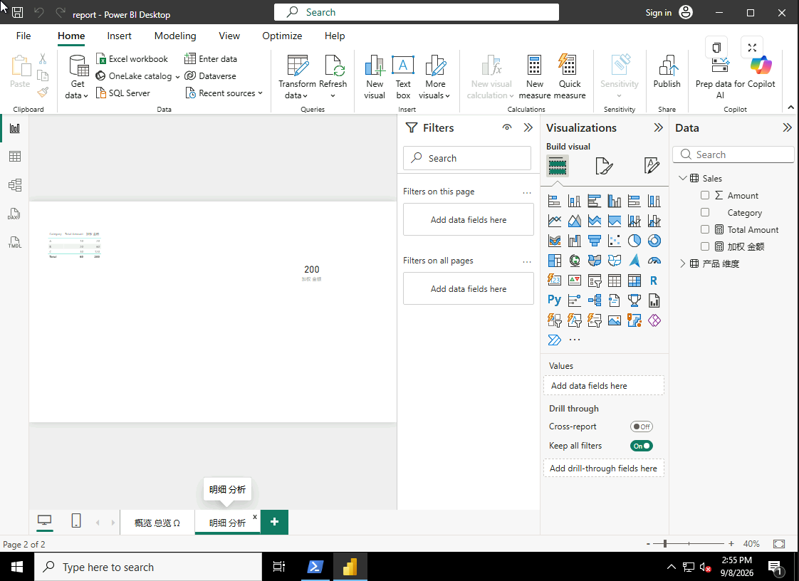

图 18：从概览切换到“明细 分析”页，先看底部第二个页签，再看卡片 200 和右侧字段。核对左侧表格的逐行贡献时，在 Desktop 中放大画布，并与上表的 20、60、120 对应。

扩展成品经过远端调用、Desktop Save As 和新进程复开，两个页面都观察到加权值 200。多页结构和模型关系由不同观察点共同检查：页签确认页面可访问，60 与 200 分别确认基本聚合及权重计算。

同一个 Rich 工程继续完成了 PBIP → PBIX → portable PBIP → PBIX：最后的成品保留两页、5 个视觉对象，总金额 60，两个页面的加权金额均为 200。下图展示这条链路的正向成品，便于理解后续往返需保留什么；最终回转的相应结果见[往返成品](../examples/Rich-roundtrip-rc4.pbix)与[复开回执](../examples/Rich-roundtrip-rc4-verification.json)。

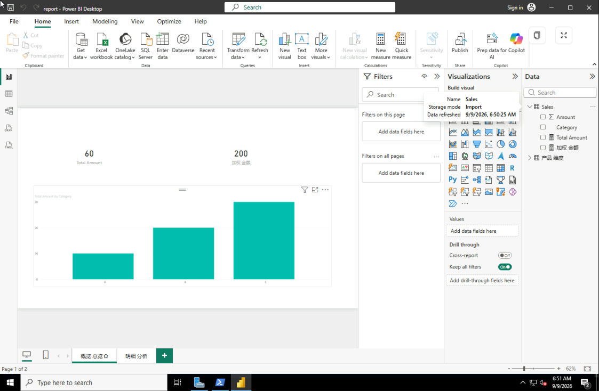

概览先看总金额和加权金额，再看 A/B/C 的 10、20、30。基本聚合与关系计算在同页形成两个观察点。

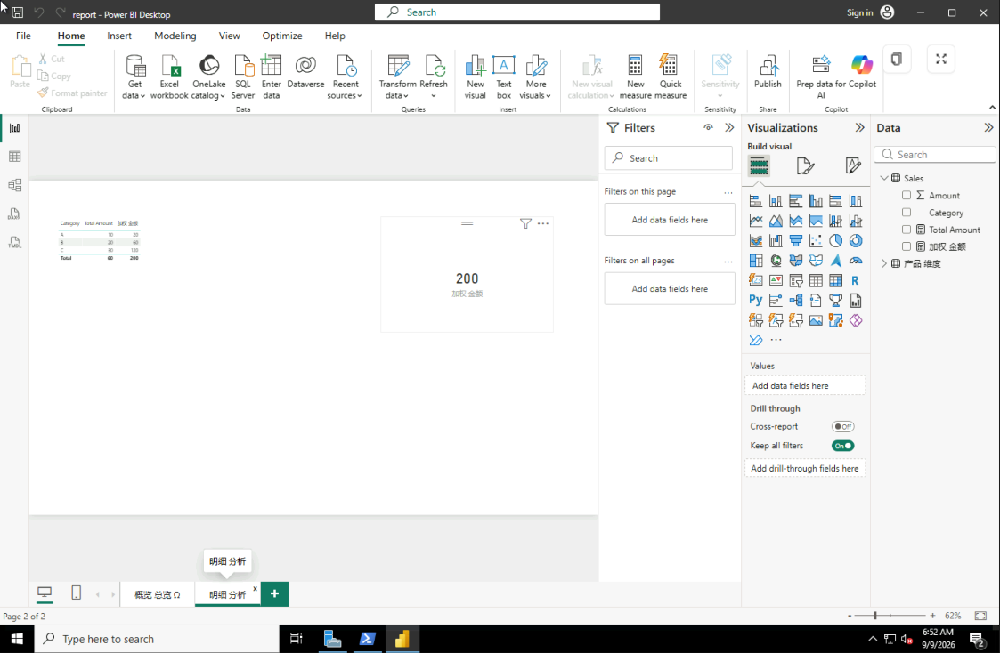

切到明细页，表格逐行显示金额 10/20/30、贡献 20/60/120，合计 60/200；右侧卡片再次显示 200。往返后的验收也应逐页对应，不能只看页数。

若要复跑，沿第 5 章已经就绪的连接，在**本机 PowerShell 终端 B**选择新的中文输出名：

```powershell
$Stamp = (Get-Date).ToUniversalTime().ToString('yyyyMMdd-HHmmss')
$Prefix = Join-Path $Desktop "PBIP-MCP-Rich-销售 分析 Ω-$Stamp"
& $Python .\scripts\run-remote-demo.py @McpConnection `
  --zip .\sample\Rich.zip `
  --output "$Prefix.pbix" `
  --verification "$Prefix.verification.json" `
  --result-json "$Prefix.e2e.json" `
  --timeout 900 --wait-ready 30
```

这条命令同时使用含中文、空格与 Ω 的本机成品名。工程对象名称支持 Unicode，而 worker 的控件适配仍使用英文 Desktop UI；更换应用菜单语言需要单独适配。

### 6.2 同时提交，与同时操作 Desktop 不是一回事

单个工程转换成功后，可以把多个请求先交给队列。批量场景使用 A（基线）、B（富样例）和 C（再次基线），分别等待结果与下载。A/B 成功，C 在执行期间因 RDP 会话丢失而失败。每个任务都保有自己的状态和产物，整批调用则汇总这些结果。

| 批量项 | 输入 | 执行关系与结果 | 运行含义 |
|---|---|---|---|
| A | 基线，1 页 1 卡片 | 先开始并完成保存、复开 | 得到独立基线成品 |
| B | 富样例，2 页 5 视觉对象 | A 执行时已入队，A 完成后才开始 | 提前提交不会使两个任务同时操作桌面 |
| C | 再次基线 | `INTERACTIVE_SESSION_LOST`，无成功产物 | 桌面中断会使当前项失败，需恢复前提后重试 |

队列把“接收请求”和“占用桌面”分开：B 可以提前等待，但只有 A 释放执行位置后才能开始。每个任务使用自己的输入和输出目录，因此检查 A 的 60 与 B 的 200 时，可以分别对应它们的回执。

小批量客户端入口每次接受 **1～3 项**，队列总容量与 worker 并发数则是另外的限制。下面在**本机 PowerShell 终端 B**生成两项清单，仍使用第 5 章准备好的连接参数，并为输出加入新时间戳。

```powershell
$Stamp = (Get-Date).ToUniversalTime().ToString('yyyyMMdd-HHmmss')
$Prefix = Join-Path $Desktop "PBIP-MCP-Batch-$Stamp"
$BatchPath = "$Prefix.batch.json"
if (Test-Path -LiteralPath $BatchPath) {
  throw 'Batch manifest already exists. Choose a new prefix.'
}
$Batch = @(
  @{
    zip = (Resolve-Path .\sample\Synthetic.zip).Path
    output = "$Prefix-A.pbix"
    verification = "$Prefix-A.verification.json"
  },
  @{
    zip = (Resolve-Path .\sample\Rich.zip).Path
    output = "$Prefix-B.pbix"
    verification = "$Prefix-B.verification.json"
  }
)
$Batch | ConvertTo-Json -Depth 4 |
  Set-Content -LiteralPath $BatchPath -Encoding utf8
& $Python .\scripts\run-remote-demo.py @McpConnection `
  --batch $BatchPath `
  --result-json "$Prefix.e2e.json" `
  --timeout 900
```

PowerShell 5.1 的 UTF-8 BOM 与 PowerShell 7 的无 BOM 都能被这个批量读取器处理。客户端先检查批内输出路径是否重复或已存在，有冲突时整批在提交前拒绝。若已经提交前几项，随后另一项因输入或队列错误失败，返回会保留已提交 ID；那些任务仍然存在，要逐项查询，不能当成自动回滚。

`ok=false` 是“整批没有全部成功”，不意味着成功项一定被删除。反过来，目录里出现前两个 PBIX 也不能证明第三项成功。批量是一个组织调用的方式，不应抹平每个任务的独立结果。

### 6.3 从输入校验到 Desktop 解析失败

换成自己的工程时，失败可能发生在 Desktop 启动之前。controller 先检查压缩包、路径和工程引用；缺少文件或入口不明确时直接拒绝，避免把无法执行的任务交给桌面。运行状态和本机文件名也有各自的前置检查，错误码可以帮助操作者找到应修复的那一层。

| 输入或状态 | 返回结果 | 处理位置 | 对操作的影响 |
|---|---|---|---|
| 非 ZIP 内容 | `INVALID_ZIP` | controller 输入校验 | 重新生成有效压缩包 |
| 缺报表或模型定义 | `INCOMPLETE_PROJECT` | controller 工程校验 | 补全入口引用的报表与模型 |
| 多个 `.pbip` 入口 | `AMBIGUOUS_PROJECT` | controller 工程校验 | 拆成每包一个明确入口 |
| 包内路径穿越 | `UNSAFE_ARCHIVE_PATH` | controller 路径校验 | 所有成员必须留在工程范围内 |
| 超出压缩比限制 | `ZIP_BOMB` | controller 压缩包校验 | 检查异常内容，避免过量资源消耗 |
| 声明单文件尺寸超限 | `ARCHIVE_MEMBER_SIZE` | controller 成员元数据校验 | 先检查输入是否符合大小限额 |
| worker 离线 | ready=false；一站式 convert 拒绝 | MCP 状态与客户端前置检查 | 恢复交互端后再转换 |
| 排队任务取消 | `queued → cancelled`，无产物 | 队列操作 | 仅覆盖尚未领取的任务 |
| 本机输出已存在 | `CLIENT_OUTPUT_EXISTS` | 客户端提交前检查 | 换新文件名，保留旧成品 |
| 内置样例被修改 | 不继承自动刷新资格 | controller 输入分类 | 重新审查查询与加载条件 |

打包规则还限制绝对路径、盘符、网络共享路径（UNC）、Windows 保留名、备用数据流（ADS）、符号链接、名称碰撞和压缩方法。它们共同保证展开后的成员仍属于私有任务目录，并控制资源使用；工程定义是否能被 Desktop 理解，则是下一层的问题。

**完整 ZIP 通过检查后，仍可能在 TMDL 解析阶段失败。** 保留的正向诊断样例在基线 `model.tmdl` 末尾加入了位置不合法、带缩进的 `ref table InvalidSyntax`。当时包结构通过后进入 Desktop 解析，内容被标记为 `synthetic_fixture=false`，未获自动刷新资格。现版本对非内置工程还先要求缓存：直接重提这份无缓存坏定义会先遇到 `DATA_CACHE_REQUIRED`，不能期待每次都到达下面的 Desktop 对话框。

Desktop 打开它时显示 “Issues were found”，任务以 `DESKTOP_DIALOG_UNSUPPORTED` 失败。这个通用码表示遇到不能继续处理的对话框；具体原因需读该任务的 UIA 文本。此例的解析信息为：

```text
TMDL Format Error:
Parsing error type - UnsupportedObjectType
Unsupported object type - table is not a supported property in the current context!
Document - './model'
Line Number - 11
Line - '\tref table InvalidSyntax'
```

这里的 `\t` 表示行首制表缩进。应修复的是定义所在上下文，而不是补更多目录或提高超时。该历史任务没有输出文件，worker 随后返回 ready/idle，可以处理后续任务。原始任务诊断未公开；自己的解析错误应读取相应私有诊断，TMDL 文件在工程中的职责见官方模型目录说明。[4]

### 6.4 换成自己的工程，先定义新的观察点

扩展样例采用了一个可复用的方法：每加入一种结构，就选择能观察它的结果。多一页就检查页签和页面内容，多一条关系就检查依赖关系的计算。只核对文件结构数量，会遗漏数量不变但业务行为改变的问题。

自己的工程应先在批准版本的 Desktop 中明确预期，再比较转换后的文件。下面这些输入或部署条件尚需独立评估，不能直接套用 60/200 的结论：

| 还需单独验证的范围 | 为什么不能从当前样例外推 |
|---|---|
| 真实 PBIP、外部连接器和凭据 | 当前数据内嵌；需另查数据源网络、连接器、凭据、参数、隐私级别和刷新授权 |
| 复杂 DAX、RLS、增量刷新、复合或 Direct Lake 模型 | 简单聚合及一条关系未覆盖这些语义；混合存储或直接读取湖数据的模型也可能超出本地模型输入契约 |
| 自定义视觉对象、地图、外部图片、复杂书签与主题 | 当前只有三种标准视觉类型，数量相同也不意味着每种交互等价 |
| 中文 Desktop UI、其他 Desktop 版本 | 当前适配英文版本菜单；对象名称中文是另一个维度 |
| 大项目、长时间稳定性、高并发和多租户 | 小样例与单 worker 无法提供吞吐量或隔离服务级别承诺 |
| 在线发布、Copilot 与嵌入 | 本地保存完成后，仍需独立处理目标服务的身份、权限与可用能力；云环境选择见第 9 章 |

选择代表性项目时，应同时带上预期页面、关键计算和允许的数据访问范围。先比较输入与成品，再决定该类工程是否可以加入支持清单。场景结果可在[验证结果与边界](03-验证结果与边界.md)按输入和故障类型查阅。

## 第 7 章 第二次运行：任务接口与持续维护

### 7.1 把“每天启动”与“一次安装”分开

第二次使用，普通用户重新登录公网工作台，从原任务继续查询或提交新文件；无需安装服务。管理员按需恢复网关、VM、已连接解锁的桌面、worker 和持久 portal。关闭自己的 SSH 终端不再停止公网入口，但 Windows 登录和 worker 就绪仍要分别确认。

| 频率 | 责任动作 | 固定入口或位置 |
|---|---|---|
| 初次部署或环境重建 | 安装、ACL、计划任务注册、首次 Desktop 准备 | `setup.ps1`、`manage-worker.ps1 -Action Register` |
| 服务窗口开始 | 管理员确认网关、桌面、worker 与持久 portal | `remote-worker.ps1`、`manage-public-portal.ps1` |
| 每个用户/任务 | 个人登录，选择方向/模式，保存任务与下载 | 网页或个人 HTTP MCP；SSH 批量仅供受信运维 |
| 用户结束 | 下载并退出个人会话 | 网页“退出”，不停止共享节点 |
| 服务窗口结束 | 协调停止提交，任务与下载结束后停服务 | portal 具名 Stop、worker Stop/Status；网关资源另行管理 |
| 定期维护 | 新任务到期维护、磁盘预算、版本兼容、身份撤销与轮换 | `pbip_mcp.admin` 与批准的运维流程 |

连续任务叫 `PBIPMCP-Worker`；如果环境中还存在一次性入口 `PBIPMCP-Demo` 或 `PBIPMCP-External`，不要让它们同时使用同一数据目录。管理脚本核对用户 SID（Windows 安全主体标识）、程序、脚本路径、工作目录与有界参数，发现不匹配就拒绝，避免仅凭同名接管其他任务。

重复 Start 在已经运行且心跳健康时返回 `already_running=true`；重复 Stop 在已停止时返回 `already_stopped=true`。这种幂等性意味着重复点击不会自动制造第二个 worker，但不能理解成所有异常都被忽略：任务显示 Running 而 worker 不ready时，Start 会报告错误，要求你检查真正的会话。

连续 worker 默认空闲 30 分钟退出，计划任务最长 2 小时。`--max-jobs 0` 表示不按完成件数退出，不表示无时限永久运行。转换中的 Stop 是“本次结束后停止接新活”；想立刻打断当前转换，需要另一套经授权的故障处理，不是把排队取消工具用于运行中任务。

### 7.2 从一站式调用，拆成可恢复的任务操作

网页已经把提交、查询、取消和下载分开。程序接入使用同样的个人身份，可在 HTTP MCP 中查询网页创建的任务，也可从网页找到程序提交的任务。服务端检查所有者，不因换了入口而扩大权限。

**个人 HTTPS MCP：完整反向示例。** 在安装 0.2.3 客户端的**本机 PowerShell**运行，使用公网 `/mcp` 与受保护的个人凭证文件，不需要 SSH 私钥。客户端默认不访问公网，必须显式加 `--allow-public-https`；它只接受 HTTPS DNS 的 `/mcp` 地址，不接受明文 HTTP、IP 地址、URL 内凭据、查询参数或重定向。

```powershell
$Desktop = [Environment]::GetFolderPath('Desktop')
$Project = Join-Path $Desktop 'powerbi-pbip-pbix-mcp-demo'
$Python = Join-Path $Project '.venv\Scripts\python.exe'
if (-not (Test-Path -LiteralPath $Python -PathType Leaf)) {
  throw 'Install the approved client release before using this example.'
}
$TokenFile = Read-Host 'Path of your protected personal access-credential file'
$InputPbix = Read-Host 'Path of an approved PBIX with a local model'
foreach ($Path in @($TokenFile, $InputPbix)) {
  if (-not (Test-Path -LiteralPath $Path -PathType Leaf)) {
    throw 'A required input or personal credential file is missing.'
  }
}
$HttpConnection = @(
  '--url', 'https://pbip-mcp-bidir-2d79425f.azurewebsites.net/mcp',
  '--allow-public-https', '--token-file', $TokenFile
)
& $Python -m pbip_mcp.client @HttpConnection status
if ($LASTEXITCODE -ne 0) { throw 'Restore personal access before submitting.' }
& $Python -m pbip_mcp.client @HttpConnection list
if ($LASTEXITCODE -ne 0) { throw 'Cannot read your task list.' }
$Tag = (Get-Date).ToUniversalTime().ToString('yyyyMMdd-HHmmss-fff')
$SubmitReceipt = Join-Path $Desktop "PBIP-MCP-Personal-Submit-$Tag.json"
& $Python -m pbip_mcp.client @HttpConnection `
  --result-json $SubmitReceipt submit --pbix $InputPbix --export-mode portable
if ($LASTEXITCODE -ne 0) { throw 'Submission failed; inspect its receipt.' }
$Submitted = Get-Content -LiteralPath $SubmitReceipt -Raw | ConvertFrom-Json
$JobId = $Submitted.job.job_id
$JobId
```

这里显式选 portable 以便离线回转；需要可编辑定义时改为 `--export-mode definitions`，或省略该参数使用默认模式。正向提交改用 `submit --zip <完整工程ZIP路径>`，不带 `--export-mode`；`--pbix` 与 `--zip` 二选一。不要将文件夹路径直接传给 CLI 的 `--zip`，文件夹上传属于网页入口。

在**同一终端**查询原任务。此块可重复运行，每次使用新的回执文件名，不重复提交：

```powershell
$Tag = (Get-Date).ToUniversalTime().ToString('yyyyMMdd-HHmmss-fff')
$JobReceipt = Join-Path $Desktop "PBIP-MCP-Personal-Job-$Tag.json"
& $Python -m pbip_mcp.client @HttpConnection `
  --result-json $JobReceipt job --job-id $JobId
if ($LASTEXITCODE -ne 0) { throw 'Query failed; restore access first.' }
$CurrentJob = Get-Content -LiteralPath $JobReceipt -Raw | ConvertFrom-Json
$CurrentJob.job | Format-List
```

`queued` 等待，`running` 继续查询，`failed` 看错误并修复；顶层 `ok=true` 仅表示查询成功。确认反向任务 `succeeded` 且产物仍 available 后，下载 PBIP ZIP 与回执：

```powershell
if ($CurrentJob.job.status -ne 'succeeded') {
  throw 'Wait for a successful original job before downloading.'
}
$Tag = (Get-Date).ToUniversalTime().ToString('yyyyMMdd-HHmmss-fff')
$Prefix = Join-Path $Desktop "PBIP-MCP-Personal-Download-$Tag"
& $Python -m pbip_mcp.client @HttpConnection download `
  --job-id $JobId --kind pbip --output "$Prefix.pbip.zip"
if ($LASTEXITCODE -ne 0) { throw 'Project download failed; keep the original job ID.' }
& $Python -m pbip_mcp.client @HttpConnection download `
  --job-id $JobId --kind verification --output "$Prefix.verification.json"
if ($LASTEXITCODE -ne 0) { throw 'Verification download failed.' }
```

若该任务仍 queued 且明确放弃，使用独立的取消分支 `& $Python -m pbip_mcp.client @HttpConnection cancel --job-id $JobId`，不在下载后机械执行。若要一次提交、等待、下载，可改用 `convert --pbix $InputPbix --export-mode portable --output <新ZIP路径> --verification <新回执路径> --timeout 900 --wait-ready 30`；全局 `--url`、`--allow-public-https`、`--token-file`、`--result-json` 放在动作名前。所有输出须不存在，避免覆盖旧成品。

**SSH 运维兼容入口。** 已有自动化可继续使用下面的分离调用，适用于持有批准运维身份的人；它不是普通门户用户的替代登录方式。一站式 convert 与分离任务操作共用持久队列，因此前端刷新、客户端重启或下载中断时，都应先查原任务。

下面所有命令在**本机 PowerShell 终端 B**运行，沿用第 5.2 节 `$Python`、`$McpConnection` 和 `$Desktop`。每个结果文件都使用新名字；工具本身也拒绝覆盖。

先只查询转换器状态：

```powershell
$Tag = (Get-Date).ToUniversalTime().ToString('yyyyMMdd-HHmmss')
& $Python .\scripts\run-remote-demo.py @McpConnection `
  --action status `
  --result-json (Join-Path $Desktop "PBIP-MCP-Status-$Tag.json")
```

再只提交，不等待转换结束。`submit` 可以在 worker 离线时接收入队，和一站式 convert 的 ready 前置检查不同；这是给调度型调用者保留的语义，不表示离线也能完成转换。旧 `--zip` 正向行为保留；反向可改用 `--pbix`、`--export-mode`，下载时 `--kind pbip`。小批量每项也可选 `zip` 或 `pbix`，并使用相应输出后缀，最多 3 项。

```powershell
$Tag = (Get-Date).ToUniversalTime().ToString('yyyyMMdd-HHmmss')
$SubmitReceipt = Join-Path $Desktop "PBIP-MCP-Submit-$Tag.json"
& $Python .\scripts\run-remote-demo.py @McpConnection `
  --action submit `
  --zip .\sample\Synthetic.zip `
  --result-json $SubmitReceipt
if ($LASTEXITCODE -ne 0) { throw 'Submission failed. Inspect its receipt.' }
$Receipt = Get-Content -LiteralPath $SubmitReceipt -Raw | ConvertFrom-Json
$JobId = $Receipt.job.job_id
$JobId
```

把 `$JobId` 与这次输入、业务请求一起记录。查询同一任务不会重新提交：

```powershell
$Tag = (Get-Date).ToUniversalTime().ToString('yyyyMMdd-HHmmss')
& $Python .\scripts\run-remote-demo.py @McpConnection `
  --action job --job-id $JobId `
  --result-json (Join-Path $Desktop "PBIP-MCP-Job-$Tag.json")
```

单独查询时，顶层 `ok=true` 只表示“任务记录读取成功”；转换是否成功仍看 `job.status`。失败任务可以被正常查询，正是持久记录要保留的行为，不能据查询命令的返回码把旧失败改认成成功。

只有任务已经 `succeeded` 才执行下载。下面是独立下载动作，可以用于原任务成功但先前客户端未取回文件的情况；它不是再次转换，也不是任意远端路径读取。

```powershell
$Tag = (Get-Date).ToUniversalTime().ToString('yyyyMMdd-HHmmss')
$DownloadPrefix = Join-Path $Desktop "PBIP-MCP-Download-$Tag"
& $Python .\scripts\run-remote-demo.py @McpConnection `
  --action download --job-id $JobId --kind pbix `
  --output "$DownloadPrefix.pbix" `
  --result-json "$DownloadPrefix.pbix-receipt.json"
& $Python .\scripts\run-remote-demo.py @McpConnection `
  --action download --job-id $JobId --kind verification `
  --output "$DownloadPrefix.verification.json" `
  --result-json "$DownloadPrefix.verification-receipt.json"
```

如果明确不想再执行，并且查询结果仍是 `queued`，才选择下面这个**替代动作**，不要把它排在成功下载后机械连着执行：

```powershell
$Tag = (Get-Date).ToUniversalTime().ToString('yyyyMMdd-HHmmss')
& $Python .\scripts\run-remote-demo.py @McpConnection `
  --action cancel --job-id $JobId `
  --result-json (Join-Path $Desktop "PBIP-MCP-Cancel-$Tag.json")
```

查询和取消之间可能发生领取，因此即使刚看到 queued，取消也可能被明确拒绝。此时应重新查询实际状态，而不是修改任务数据库。任务进入 running 后由 worker 负责完成或报错，不是客户端随意把状态改成 cancelled。

### 7.3 给维护者一张资源边界表

限额不是越大越好。小型桌面工作节点一旦接收过量任务，保存的输入、工作副本与输出预留会先耗尽磁盘；把 GUI 超时关闭，又可能让一个弹窗占住所有后续请求。本实现的默认值用于约束这个 Demo 的行为，不代表官方 Power BI 上限。

| 限制 | 当前默认值 | 用户能看到的后果 |
|---|---:|---|
| 单次上传的 ZIP/PBIX | 16 MiB | 超限输入先被拒绝，不开始 GUI |
| 公网网关请求体 | 24 MiB | 容纳 multipart/base64 包装，不把后端文件限额提高到 24 MiB |
| 展开总大小 / 单成员大小 | 128 MiB / 64 MiB | 防止小包声明或展开巨量内容 |
| 文件项数 / 压缩比 | 4096 / 200 | 拒绝异常包结构与压缩比 |
| 全局 / 每人待办上限 | 32 / 3 | 个人与共享节点分别限额，不无限积压 |
| 每小时每人 / 全局提交 | 30 / 100 | 限制过量提交，不靠持续重试占队列 |
| 全局 / 每人留存预算 | 各 2 GiB | 包含输出预留；预算不足停止接收 |
| 单产物预留 | 512 MiB | 实际可接收任务数可能远少于 32 |
| 排队期限 / 转换期限 | 1800 秒 / 600 秒 | 无 worker 或桌面卡住最终明确失败 |
| worker 心跳过期 | 15 秒 | controller 不再断言 Desktop ready |
| MCP 下载块 | 最大 256 KiB | 文件按偏移连续读取并校验 |
| 新任务终态留存 | 默认 24 小时 | 管理员显式维护后产物过期，历史结果保留 |
| portal 同时读取上传 / body 期限 | 2 个 / 120 秒 | 单次读取等待最长 30 秒，有界接收而非无限缓冲 |

MiB/GiB 是二进制计量单位；例如 16 MiB 等于 16×1024×1024 字节。表中的 2 GiB 不是云盘的物理容量，而是代码为留存与工作空间设定的服务预算。到限额时，应检查已有任务与预留量，不能仅看 Windows 还有空闲空间就断定配额检查出错。

server、portal 与 worker 可通过同一 `--limits-config` 配置正整数限额，不能配置无限大小或无限等待。使用 `C:\PBIPMCP\data` 这样的短工作根；路径层级过深时会明确 `WORKER_PATH_LENGTH`，不应把 Windows 路径失败误判为格式不支持。

留存是**显式管理员维护**，不是后台自动删除。`pbip_mcp.admin cleanup --data-dir C:\PBIPMCP\data` 每次最多处理 100 个到期新任务，只清理这些任务命名的输入、工作副本、证据和输出，保留数据库历史及维护审计。运行中任务、持续下载和迁移前 legacy 任务受保护；旧资料和原件不由这个入口删除。保留期限在入队时写入，后改配置不追溯改写旧任务期限。

持续下载使用“租约”表示文件正在传输。网页 HTTP 流持有持久文件租约；异常退出遗留租约会保守阻止清理，管理员确认没有下载进程后再处理。MCP 则先调用 `begin_artifact_download`，每块 `get_artifact` 带 `download_id`，完成或异常后调用 `finish_artifact_download`。传输 ID 绑定用户、任务和产物，每块续租 300 秒；新版 CLI 自动管理，过期后应重新开始而非沿用失效 ID。

每个调用者最多 64 个有效传输租约。旧客户端不传下载 ID 时保留兼容的保守租约，最后一块后仍保护 300 秒，避免一条下载结束影响另一条下载。到期清理后返回 HTTP 410 / `ARTIFACT_EXPIRED`，不返回空文件或把历史成功改成失败。操作前先按组织要求归档，具体命令和责任见运行手册第 6.8 节。

### 7.4 Desktop 更新后，把兼容性复验当作维护工作

桌面自动化依赖真实控件、菜单路径和保存行为，版本更新可能改变其中任一层。持续可用的正确做法是记录版本、在维护窗口升级、先跑已知 60 和 200 样例，再跑客户代表性项目；观察保存路径、页面结构和新进程复开是否仍一致。

如果新版失败，不应未经许可全局禁用安全提示或增加“任何窗口都点确定”的逻辑。保留新版诊断，在不覆盖原件的环境中评估适配；需要回滚时由维护者使用批准的安装包和备份，考虑新格式是否还能被旧 Desktop 打开。官方只支持最新 Desktop，长期钉死旧版本不能解决支持责任问题。[2]

稳定部署还需要组织批准、ACL 限定的身份位置与轮换流程；操作脚本只接受路径，日志不要记录秘密内容。维护记录应关联运行窗口、当前版本、支持的工程类型、任务保留策略和负责人，使后续操作者能沿同一套条件重复使用。

## 第 8 章 失败后怎么判断、怎么恢复

### 8.1 先找到失败的层，而不是先重新提交

一次调用跨了多层，终端最后一个错误未必就是根因。按下面顺序只做与当前症状有关的最小确认。越早的一层没有恢复，越不应该往后反复提交任务。

| 症状 | 第一处看什么 | 合理的下一步 |
|---|---|---|
| 门户显示 VM 已停止 | VM 电源与批准运行窗口 | 负责人恢复 VM，再连接桌面 |
| 试用网页打不开 | App Service、VNet 后端连接、portal 任务 | 管理员恢复网关/服务，用户不需本机 SSH 转发 |
| 个人登录失败或会话到期 | 用户是否仍有效、入口是否正确 | 同身份重新登录；撤销或轮换由管理员处理 |
| 看不到其他人的任务 | 服务端所有权检查 | 正常授权边界，不改用共享管理员凭证 |
| 缺缓存或产物过期 | 模式、`DATA_CACHE_REQUIRED`、`ARTIFACT_EXPIRED` | 处理数据加载或重新申请转换，不借旧缓存/改历史状态 |
| 本机 SSH 连不上 | 自己的隧道终端、端口与 `whoami` | 重建自己的失效通道，核对目标与指纹 |
| SSH 可以，MCP 启动即失败 | 客户端环境与 VM Python 路径 | 检查官方 SDK 启动错误、`PROGRAMDATA` 和部署版本 |
| controller 返回 ready=false | worker 心跳、Bastion 用户桌面 | 连接并解锁，Doctor/Start，确认独立 worker 状态 |
| 一直 queued | worker 是否接单、排队期限 | 不重复提交；查原任务、启动正确 worker 或取消队列任务 |
| running 后 Desktop 报打开失败 | 该任务私有 UIA/错误信息 | 修复工程或版本，保留原件，再建新任务 |
| Save As 超时或目标不存在 | 指定输出路径及本任务保存阶段记录 | 定位控件与保存路径，修复后创建新任务 |
| 新进程复开失败 | PBIX 结构、不同 PID 与复开证据 | 拒绝交付可疑成品，定位真正保存结果 |
| 任务 succeeded 但本机下载失败 | 原任务状态、输出名、下载摘要 | 对同一任务重新下载到新名字，不再转换 |

工具自身拒绝请求时，会设置 MCP `isError` 并提供结构化 `error.code` / `error.message`；`get_job` 则可以正常返回一个 `failed` 任务，查询成功不等于执行成功。优先看这一层次及明确错误码，不从一行堆栈猜进度。`get_artifact` 对未成功任务返回 `ARTIFACT_NOT_READY`，这是防止半成品交付的保护，不是需要绕过的障碍。

### 8.2 三个真实问题，说明为什么不能只看表面成功

**问题一：文件名读回正确，Windows 却没按它保存。** 早期实现用 UIA `SetValue` 修改 Save As 的文件名，读取控件时也能得到完整目标路径，但真正保存仍落到工作目录下的默认文件名。原因是控件的显示值与应用收到的编辑变更通知并不总是一回事；“自动化读回了值”不足以证明应用接受了修改。

现有实现只对已核验进程与窗口句柄（PID/HWND）的原生文件名 Edit 控件发送 `EM_REPLACESEL`，以触发编辑变更；随后同时核对原生/UIA 值、指定的 `output\report.pbix` 和新进程复开结果。这样，判断从“控件看起来正确”延伸到“应用确实按目标路径保存”。如果再出现类似症状，应保留失败记录并检查保存阶段，而不是手工移动文件绕过检查。

**问题二：直接运行 SSH 可以，SDK 里连 SSH 版本都读不到。** Windows OpenSSH 依赖非敏感环境变量 `PROGRAMDATA`。SDK 的默认环境过滤曾漏掉它，使 SSH 在真正连接之前就退出，连 `ssh -V` 都失败。现有处理只额外传递这个必需变量，不转发整份 `os.environ`、Azure 凭据或令牌缓存。排障时先区分子进程启动失败与网络连接失败，才能修到正确层。

**问题三：安装命令成功，但远端仍在运行旧代码。** setuptools 可能使用 `build\lib` 中时间戳较新的旧副本，造成源目录已改而运行时未更新。维护者在源码升级后，应比较批准源码与 venv 实际安装文件的摘要；发现旧副本时只清理对应构建产物，再重新安装。普通操作者不必每天重装，但维护者需要确认补丁确实进入运行环境。

其他就地故障也遵循同样原则：PowerShell 中含空格路径要正确引用；`win32ui` 缺 DLL 要补微软 x64 运行库，而不是重试同一命令；TMDL 顶格引用和 PBIR 两个不同位置的版本号不能因为都叫 version 就写成同一个值。输入 schema 校验有用，但它不能取代实际 Desktop 对 TMDL 与报表定义的解析。

### 8.3 交互会话丢失后，恢复前提再提交

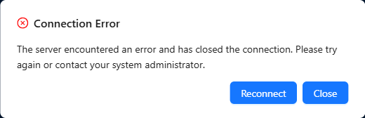

图 19：Bastion 的 Connection Error 表示桌面连接已丢失。先通过 Reconnect 恢复到正常用户桌面，再检查 worker 和原任务状态；仅恢复浏览器页面还不够。

批量 C 因宿主浏览器内存不足而丢失 RDP 会话，以 `INTERACTIVE_SESSION_LOST` 失败。它的输入与基线相同，差别在运行条件：桌面中途不再可用，worker 无法继续可靠地操作窗口。因此，即便前两项已经成功，第三项仍须按独立失败处理。

恢复时先保留原任务 ID，再恢复 RDP 到同一个批准用户并确认桌面已解锁；随后恢复自己的 SSH 隧道并核对身份，通信恢复后查询原任务状态。若原任务仍 running，等待并继续查询；若已 succeeded，直接下载；**只有确认原任务 failed 后，才依次调用 Doctor、Start、Status，并向已 ready 的 worker 提交新任务**。旧任务与新任务分别保留，使输入、错误和成品不会混淆。

执行位置：**本机 PowerShell 终端 B**。前提：已重新完成第 5.1—5.3 节的桌面和通道准备，并按第 7.2 节确认原任务 failed。此时执行新任务分支：

```powershell
.\scripts\remote-worker.ps1 @WorkerConnection -Action Doctor
.\scripts\remote-worker.ps1 @WorkerConnection -Action Start
.\scripts\remote-worker.ps1 @WorkerConnection -Action Status
$Stamp = (Get-Date).ToUniversalTime().ToString('yyyyMMdd-HHmmss')
$Prefix = Join-Path $Desktop "PBIP-MCP-Recovery-$Stamp"
& $Python .\scripts\run-remote-demo.py @McpConnection `
  --zip .\sample\Synthetic.zip `
  --output "$Prefix.pbix" `
  --verification "$Prefix.verification.json" `
  --result-json "$Prefix.e2e.json" `
  --timeout 900 --wait-ready 30
```

历史恢复场景按这个顺序重新建立桌面和 worker，新基线完成了 Desktop 保存、新进程复开及下载，卡片显示 60。与此同时，新 controller 连接仍能查询旧 C 的 `failed / INTERACTIVE_SESSION_LOST`，旧任务没有产物。原始恢复记录未公开；这里强调的是状态语义：执行前提修复后可以开始新的转换，持久任务记录则延续原来的结果。

本例采用浏览器 Bastion。原生 RDP 客户端也是官方连接选项，但需要满足本机凭据和组织登录策略；本演示未打通该路线，切换前应独立确认。[9] 交互断线恢复已覆盖，主动终止 worker 后的清理与恢复还需另行演练。

### 8.4 客户端重启、worker 中断和 VM 关机分别处理

客户端断开后，先按已记录 ID 查询。如果任务已经成功，下载即可；如果仍运行，等待；如果明确失败，修复对应前提再创建新任务。客户端 `CLIENT_TIMEOUT` 只表示它不再等待，不能直接证明服务端失败。

worker 意外退出时，controller 按心跳时间判断可用性，过期后显示 stale；如果任务执行期限加清理宽限也已过去，会进入 `WORKER_TIMEOUT`。现有实现中，持有排他锁的新 worker 启动时会把遗留 running 任务标为 `WORKER_INTERRUPTED`，并拒绝旧任务执行权失效后迟到的成功提交。这是中断后的状态处理规则，完整进程中断演练仍需按第 8.3 节单独安排；复试使用新任务。

VM 关机会同时影响桌面、worker、portal 和后端连接，磁盘中的记录仍可恢复查询。开机后先恢复专用用户登录；portal 的 AtLogon 触发只在登录成立时启动，worker 还要求桌面 Active、解锁并有新鲜心跳。若管理员曾显式 Stop portal，其任务会停用，必须按运行手册明确 Enable 后 Start，不能期望它自行覆盖停用决定。只关网页或本机 SSH 终端不再停止公网服务，只重启 portal 也不会重提任务。

本机 `CLIENT_OUTPUT_EXISTS` 应通过新文件名解决。客户端在提交前拒绝覆盖已有成品，使每份文件都能对应明确的输入和任务；重试不会替换先前交付。

## 第 9 章 独立横向比较：什么时候不该使用转换器

### 9.1 先固定比较任务，才能谈替代方案

比较技术路线时，最常见的错误是拿不同终点的能力互相“打败”。一个 API 能在服务中创建报表，不等于它输出了本地含数据 PBIX；一个 CLI 能编译薄报表，也不等于它能编译任意包含模型的 PBIP；一个 Desktop 自动化能够另存为，也不等于它比云端部署更适合网站里的在线报表。

因此，下面分别讨论两个共同任务。**任务 A：文件与工程往返**，已有完整 PBIP 需要 PBIX，或已有 PBIX 要导为可编辑工程，并按需要保留离线数据。**任务 B：在线报表**，用户只需要在线访问或编辑，不要求本地文件。两者都要保持业务口径、权限和版本可追溯，但最终产物不同。

| 比较轴 | 任务 A：文件与工程往返 | 任务 B：在线报表 |
|---|---|---|
| 最终验收 | PBIX 或完整 PBIP、对应数据模式、模型/报表及复开 | 工作区或应用内报表、授权访问、刷新 |
| 输入保真 | 既有工程哪些结构必须保留 | 是迁移既有报表，还是按模型新建页面 |
| 执行依赖 | Desktop 版本、交互桌面、数据条件 | 目标租户 API、身份、许可/容量、服务限制 |
| 失败恢复 | 原件、任务、成品和下载分开恢复 | 部署操作、工作区状态、定义版本和权限恢复 |
| 主要维护成本 | 桌面会话、GUI 适配、节点容量与值守 | 应用/流水线、令牌、服务配置与在线容量 |

以下按各路线的一手资料比较输入、输出和运行责任；MCP worker 的行为另有本文样例结果作为依据。由于缺少同条件性能和成本测量，取舍以能否满足共同任务及维护条件为主。

### 9.2 必须交付 PBIX：先看 Desktop，再看能否接受自动化边界

**Desktop 人工另存为是最直接的基线。** 操作者打开 PBIP 保存为 PBIX，或打开 PBIX 保存为完整 PBIP，再关闭并重新打开结果；工程目录、缓存和共享前的敏感内容由人检查。这条路径原生解决文件转换，人工也能理解数据源与未知对话框。重复性、记录与排队需要自己管理；任务少、工程差异大、需要人工判断时，保留人工路径可能最合理。[1]

**本文的网页/MCP worker 是对同一个 Desktop 流程增加控制层。** 它固定双向输入、definitions/portable、个人任务授权、持久队列、串行执行、复开和下载，使普通用户与程序使用同一服务。增加的是可重复的文件工作流，而不是在线报表编辑器；相应仍承担 Desktop 版本适配、专用会话维护及受信输入责任。

**pbi-tools 需要仔细看输入格式与输出限制。** 所引 CLI 使用页标为 Desktop 1.2.0，其中 `compile` 接收 **PbixProj** 目录，PBIX 输出只支持 report-only 的“薄报表”，即不包含本地数据模型、依赖已有模型的报表；含数据模型的项目应输出 PBIT。PBIT 打开后仍可能要求参数或凭据并触发刷新。PbixProj 是该工具的工程体系，不能把任意 PBIP 目录原样当作它的同义词。[10]

这并不是说 pbi-tools 没价值：如果你的资产本来就是它支持的 PbixProj，目标是薄报表或模板，它的离线编译和既有部署工作流可能更合适。可是一旦验收明确为“本例这个含数据、含模型、能新进程复开的 PBIX”，就不能把 PBIT 或薄报表结果记作同一任务完成，更不能只改扩展名消除差异。

| 路线 | 输入与输出 | 自动化方式 | 对本次“含模型 PBIX”任务的判断 |
|---|---|---|---|
| Desktop 人工 Save As | 完整 PBIP → Desktop 保存的 PBIX | 原生 GUI，人处理提示 | 官方文件转换路径；适合保留为基线与例外处理 |
| 本文网页/MCP worker | 完整工程 ↔ PBIX，导工程选 definitions/portable | 个人身份 + 队列 + 普通用户 Desktop GUI | 适合受控重复输入和工程往返；仍需桌面与逐类工程验收 |
| pbi-tools compile | PbixProj → 薄报表 PBIX，或含模型 PBIT | 工具自身 CLI | 不是通用 PBIP 含模型 PBIX 的直接替代，需接受格式/输出边界 |

需要混合方案时，也应先写清新增责任。例如“先编译 PBIT，再用 Desktop 加载与另存为”仍包含数据条件和 Desktop 阶段，不能宣传成已经完全无 GUI。若客户并不要求数据随文件一起交付，模板或薄报表可能足够；那是改变了验收口径，应由业务方明确接受。

反向需求也要先固定目标：如果要得到原生 PBIP，直接比较 Desktop Save As 与本服务的工程导出；如果接受 pbi-tools 的 PbixProj，则按其格式体系另行评估提取/编译链路。不能仅因两者都是文本目录，就认为 PBIR/TMDL 引用和数据缓存能原样互换。网页入口不会改变这个格式差别，也不会把任意二进制 PBIX 解析变成官方公共 API。

### 9.3 只要在线报表：直接部署定义可能更短

Microsoft Fabric 是承载 Power BI 等分析能力的服务平台，工作区是组织模型、报表等项目及其访问权限的容器。微软提供从源代码定义部署到工作区的路线，包括 Git 集成与 Fabric REST item definitions（通过 API 提交项目定义）；`fabric-cicd` Python 库则把依赖顺序、参数化与工作区部署组织起来。[11][12]

对销售例子来说，在线部署可先建立语义模型，再建立引用它的报表。报表在服务端引用目标模型 ID，而不是继续引用本机相对目录；数据源凭据、刷新和环境参数需要在目标工作区明确配置。成功结果是工作区里的模型与报表，不是一份 Desktop 自动保存的本地文件。

Fabric 的 Create Report 和 Create Semantic Model API 都要求定义、相应工作区权限和适当许可，并可能返回长时间运行的操作状态；`202 Accepted` 只是已接收，还要按接口规则跟踪完成。不能把这些 API 的异步部署也简化为“一条请求立刻得到可用报告”。[13]

Git 集成则把工作区定义与仓库版本联系起来，适合审查、分支和回退；支持的 item 类型和连接方式有边界，不受支持对象不会因为仓库已连上就自动被保存或同步。[12] 本地 `cache.abf`、目标端数据加载与元数据部署也应分清：本地 PBIX 成功不证明云端刷新凭据已经配置，云端定义部署成功也不证明本机缓存已随之可用。

如果客户真正的交付物是“网站中能看到更新后的销售报表”，而且目标租户明确支持所需 API、Git 与容量条件，那么先生成/审查定义、直接部署、再验收在线报表，通常能少掉本地 PBIX 这个不必要的中间产物。这是流程选择，不是断言 Fabric 无条件更便宜；成本、数据合规与中国云可用性仍需按目标环境评估。

### 9.4 在线创作：Embedded Report Authoring 与文件转换不同

另一条路线是在应用内提供报表创作界面。Power BI JavaScript API 可以基于已有数据集/语义模型创建新报表，进入编辑模式，添加视觉对象与字段绑定，再保存到工作区。创建前要有模型的 build 或 write 权限、适当令牌和客户端权限；保存到其他工作区还需要目标工作区权限。[14]

例如，应用让用户选择“类别”和“总金额”，再创建一张柱形图、绑定字段并保存。这种体验适合“在网站里按已有模型构建自己的视图”。它不以转换任意 PBIP 为核心，也不把 `report.saveAs()` 的“保存副本”解释成本地 Desktop 的“另存为 PBIX”：前者保存的是服务中的报表副本。

视觉创建 API 要在报表完成渲染后调用，且视觉对象必须已经在可视化窗格中可用；一个未安装的自定义视觉对象不能只靠字符串名字创建出来。[15] 模型设计、数据源、授权、嵌入容量及应用安全仍由上游和平台负责，不因为画布在浏览器里就消失。

| 在线路线 | 怎样完成销售报表任务 | 最终产物与状态 | 需要额外承担什么 |
|---|---|---|---|
| Fabric item definitions / fabric-cicd | 从已审查的模型、报表定义部署并解析引用 | 工作区 item；跟踪部署结果和在线可见状态 | 身份、许可/容量、凭据、刷新、环境参数、部署恢复 |
| Fabric Git 集成 | 让支持的工作区定义与仓库版本同步 | 工作区与 Git 中的版本化定义 | 仓库/工作区双边权限，支持类型与冲突管理 |
| Embedded Report Authoring | 依已有模型在应用里创建/编辑视觉对象并保存 | 在线报表或副本，不是本地 PBIX | 应用、令牌、编辑授权、前端状态、在线容量 |

### 9.5 中国云决策：验证具体链路，而不是改一个域名

世纪互联运营的 Power BI 是物理隔离的云环境，官方明确其功能可用性与商业全球云存在差异；“尝试在全球可用后跟进”不是保证每个依赖都已到位。[16] 当前 Fabric Copilot 官方说明还写明尚不支持主权云，因此不能用日本 VM 里的本地保存或全球云门户截图推导世纪互联 Copilot 可用。[17]

尤其要分开“在中国可访问一台 Windows VM”“Windows 中 Desktop 能保存 PBIX”“中国租户接受某种发布 API”“用户在中国租户能使用 Copilot/嵌入创作”。它们是四个不同问题，前三个中的任意一个成功，都不能替代最后一个的证据。

| 客户条件 | 更合理的优先路径 | 作决定前必须确认 |
|---|---|---|
| 只要少量可交付 PBIX，项目变化大 | 保留 Desktop 人工路径 | 客户项目在批准 Desktop 版本中的保存与复开 |
| 必须 PBIX，输入受控且重复调用多 | 评估本 MCP worker 的持续试点 | 会话责任、代表性工程、恢复与支持范围 |
| 已有 PbixProj，接受薄报表或模板 | 评估 pbi-tools 既有工作流 | 输入格式和最终产物确实满足验收 |
| 只要在线报表，目标环境支持 Fabric 定义部署 | 优先评估直接部署 | 目标租户 API、工作区、数据源、许可与容量 |
| 想让用户在业务应用中在线创作 | 评估 Embedded Authoring | 模型权限、令牌、编辑/保存以及消费侧容量 |
| 必须落在世纪互联环境 | 先做目标环境最小验证再选路线 | 官方当前清单、目标端点与租户设置、许可证、实际创建/读取/保存结果 |

选择最终应落到交付物与运行责任：需要 PBIX 时评估 Desktop 路线，只要在线报表时评估目标服务的原生能力。确定路线后，还要决定输入信任、安全隔离、资源成本和维护责任。

## 第 10 章 部署决策：安全、成本与运行责任

### 10.1 最小权限与可信输入，不能用 ZIP 校验代替

ZIP 校验保护的是文件包如何进入任务目录：路径是否越界、内容大小是否异常、入口是否明确。它不理解所有 M 查询或自定义视觉对象的运行行为。一个路径完全合法的 PBIP，仍可能包含外部连接、查询逻辑、缓存或资源引用；“解压安全”不等于“执行任意上传内容安全”。

因此，试用以受信任人员和经批准的工程为前提；现有业务数值证据来自自包含合成项目，自动刷新仅给逐文件匹配的内置样例。专用 VM 不放无关项目数据、个人令牌或云管理凭据。准备接收真实工程前，需要单独评估数据来源、代码行为、连接器、出站网络、用户隔离、缓存与日志，而不是把刷新白名单改为全部允许。

| 边界 | 当前做法 | 客户化前的责任 |
|---|---|---|
| 操作者身份 | 网页个人 Cookie + CSRF，同身份 MCP Bearer；SSH 只给管理员 | 个人身份发放/撤销与轮换；企业 SSO 另接组织认证 |
| 文件访问 | 服务端逐次 owner 检查，任务私有目录，原件/工作副本分离 | 不同客户或不可信域需要独立节点与存储，不能只靠 owner 字段 |
| 进程访问 | 只控制自己的 Desktop 进程与窗口 | 验证异常清理不会触及用户其他会话 |
| 数据执行 | 内置合成样例才自动刷新 | 真实 M、连接器、凭据与外部访问必须评估 |
| 证据共享 | 对外图像脱敏，私有诊断单独保留 | 明确谁可看业务数据、输入定义与错误日志 |
| MCP 工具能力 | 不接受任意命令或任意远端路径 | 新增接口前审查是否扩大可操作范围 |
| 工程导出 | definitions 不带缓存；portable 只带本任务缓存 | 两者都需内容审查；无缓存不是无数据或自动脱敏 |
| 服务暴露 | 公网 App Service HTTPS → 限定网关子网 → VM 私网 portal；个人认证仍必需 | 企业 SSO 与跨安全域隔离另行设计，不能信任任意用户头 |

如果后续接入 Agent，还要加上上游的审查责任：它生成的字段、DAX、报表定义可能语法合法但业务错误；模型上下文可能进入 LLM 提示或日志。本文转换阶段未调用 LLM，不意味着整个未来 AI 系统自动符合数据出境或隐私要求。应把“谁生成定义、谁审批、谁允许执行、谁验收”分开记录。

诊断信息也应按数据处理：截图可能包含报表数值，UIA 文本可能暴露模型定义，原始 ZIP 则包含提交的工程。对外分享前应明确接收范围、保留期限和可见字段；运行手册中的资源定位参数可以帮助找到环境，但不代替身份授权。

### 10.2 成本按资源生命周期算，不按“转换按钮点了几次”猜

本方案没有 LLM 推理费这一转换步骤，但仍有 Windows VM、磁盘、网络、Bastion 及公网网关的 **P1v3 Linux App Service Plan** 成本。公开价、估算和实际账单应分开：2026-09-09 查询 Japan West 的 Windows D2s_v5 零售价约 **0.216 美元/小时**，Standard Bastion Gateway 基础项约 **0.29 美元/小时**，仅这两项同时存在/运行时约 **0.506 美元/小时**。该小计**不含新增 App Service Plan**，也未含磁盘、额外网关实例、IP、传输、日志、税费与协议差异，不能再当公网整套方案总价。[18][19]

更重要的是，两个资源不一定同时结束计费。VM 达到 **Stopped (deallocated)** 后不再按运行 VM 计算计算资源费，但保留磁盘和其他相关资源仍可能收费；仅在 Windows 内关机可能仍属于已分配状态。Bastion 按部署存在计费，不因为没人连接或者 VM 关了就自动暂停。[18][20]

| 做了什么 | 确实停止了什么 | 仍需要负责人注意什么 |
|---|---|---|
| Stop worker | 不再持续接单；当前任务结束后退出 | VM 与 Bastion 仍存在 |
| 关闭本机 tunnel / RDP | 本机连接 | 云资源不会因此删除或释放 |
| VM 停止并解除分配 | 运行计算资源费 | 保留磁盘、IP、Bastion 等项目 |
| 保留 Standard Bastion | 保留连接能力 | 无会话也持续计基础费 |
| 保留 P1v3 App Service Plan | 保留公网网关的托管计算容量 | 空闲或只停 Web App 不等于释放计划费用，需按计划生命周期管理 |
| 删除某项资源 | 该项按其生命周期停止计费 | 关联资源不一定随之删除；操作须另行授权 |

单次转换耗时只占资源使用期的一部分：会话准备、排队等待、故障恢复和空闲期间仍可能占用计费资源，Bastion 则在整个保留期持续计费。因此，预算应按资源生命周期计算，结合批准的使用窗口与保留策略估算，再通过 Cost Management 将实际账单归因到相应环境或工作负载。

当前试用按授权关闭了 VM 自动关机，以减少长时间试用中的定时中断；因此持续运行的计算、磁盘、Bastion 和 App Service Plan 都要进入预算。关闭自动关机不是高可用保证，Windows 登录、worker 空闲退出和应用健康仍需值守。低频场景可另设获准窗口与关机策略，但不能在有人转换或下载时擅自改变。成本应按资源生命周期和实际账单归因，而不是按转换耗时外推。

### 10.3 从受控试点到内部服务，需要补齐什么

当前成果适合作为**同一安全域内的受控多人试用**：已有双向转换、个人网页/HTTP MCP、任务授权、往返及有界维护，运行仍依赖交互桌面、已适配版本和受信任输入。扩大使用范围时，每一阶段都要增加与新责任相匹配的验收条件。

| 阶段 | 输入与目标 | 退出该阶段需要的证据 |
|---|---|---|
| 当前受控试用 | 60/200 往返、definitions、个人网页/MCP、输入拒绝与恢复 | 对应模式的成品、数值或定义，以及个人任务与下载 |
| 客户代表性试点 | 经批准脱敏工程，约定页面、计算与连接范围 | 客户期望与实际结果、版本矩阵、文件/数据/权限检查 |
| 可持续内部服务 | 已批准操作者与稳定使用窗口 | 次日启动、断线/进程中断恢复、容量/留存/升级流程及负责人 |
| 生产化评估 | 跨安全域数据、更高并发、企业登录与服务级别 | 租户/节点隔离、代码执行边界、支持架构、审计与成本责任 |

每个阶段都应约定例外处理：未知连接器先审查，登录提示交由有权操作者确认，并发需求先评估节点隔离而不是同时驱动一个桌面。复杂项目需要人工判断时，保留 Desktop 人工另存为作为回退路线；当前受控 GUI 链路尚不是生产级无人值守或多租户平台。

交接时最好把责任说到角色：环境管理员负责 VM、依赖、任务主体与密钥；值守操作者负责当次桌面、就绪和收尾；模型/报表作者负责输入与业务口径；平台维护者负责接口、版本复验、日志和留存；数据与安全负责人决定客户工程可以进入什么环境。不同角色可以是同一人，但责任不能留空。

### 10.4 三个练习，检验你是否能独立判断

**练习一：同事只发来 `Sales.pbip`，你能提交吗？** 不能仅凭这个入口判定工程完整。先要对应的 Report 和 SemanticModel 目录、有效相对引用及允许的资源文件，再打包符合本服务契约的完整 ZIP。如果对方只有入口，不应让转换器“联网猜着补齐”。

**练习二：MCP 给了任务 ID，但桌面还没有 PBIX，应该再点一次吗？** 先查原 ID。queued 表示已接收未执行，running 表示正在操作，failed 要看明确错误，succeeded 才去下载。客户端超时不一定是任务失败；先恢复连接查询，可以避免一次业务请求被重复保存多次。

**练习三：客户说“不需要文件，只要在线编辑销售报表”，还必须部署本转换 VM 吗？** 不必须。先看目标租户是否支持 Fabric 定义部署或 Embedded Authoring，以及模型、权限、许可/容量是否满足。终点变了，合理路线可以变；中国云必须查当前官方限制并在目标租户做最小链路验证，不能套用全球云演示结论。

如果你能解释这三个判断，也能在一份新 `.e2e.json` 中定位“接受、执行、复开、下载”分别到了哪一步，那么你掌握的就不只是几条命令，而是这套方案何时可用、何时该停、何时应换路线的依据。

## 附录 A 术语与命令索引

| 术语 | 一句话解释 | 正文位置 |
|---|---|---|
| 语义模型 | 表、关系与业务计算的组织层 | 2.1—2.2 |
| 报表 / 视觉对象 | 页面与其中的卡片、图表、表格及字段绑定 | 2.1 |
| PBIP / PBIX / PBIT | 工程入口体系 / Desktop 成品 / 模板 | 2.3 |
| definitions / portable | 不带模型缓存的定义工程 / 带本任务缓存的工程 | 2.3、6 |
| Cookie / CSRF / Bearer / owner | 浏览器会话 / 防跨站请求校验 / 程序访问凭证 / 任务所有者 | 3.1—3.2 |
| M / DAX | 数据加载转换规则 / 模型计算规则 | 2.2、6.1 |
| TMDL / PBIR | 模型文本定义 / 报表定义格式 | 2.2—2.3 |
| MCP / controller / worker | 工具协议 / 接单查询 / 执行桌面转换 | 2.4、3 |
| stdio / SSH / RDP | 进程输入输出 / 命令通道 / 交互桌面 | 3、4.2、5 |
| job ID / SHA-256 / PID | 任务索引 / 文件内容摘要 / 进程标识 | 3.2—3.3 |
| ready / stale | worker 当前就绪 / 心跳已过期 | 3.2、5.4 |
| 解分配 / 保留资源 | VM 释放计算分配 / 磁盘等仍保留 | 10.2 |

以下是命令入口索引，不是需要按行全部执行的一段脚本；完整变量、权限与先后顺序以正文对应位置为准。

| 要做的事 | 入口 | 执行位置 |
|---|---|---|
| 首次 VM 依赖与 ACL 准备 | `scripts\setup.ps1` | VM 管理员 |
| 首次注册连续 worker | `manage-worker.ps1 -Action Register` | VM 管理员 |
| 日常诊断、启停、状态 | `remote-worker.ps1 -Action Doctor/Start/Status/Stop` | 本机 PowerShell，经已认证 SSH |
| 直接交互 worker（维护替代） | `scripts\start-worker.ps1` | VM 普通用户交互终端，不与连续任务同时使用 |
| 本机到 VM 命令通道 | `az network bastion tunnel`，本机 50027 → VM 22 | 本机 PowerShell 专用终端 |
| 身份确认 | `ssh ... whoami`，完整参数见 5.3 | 本机 PowerShell |
| 一站式转换 | `run-remote-demo.py`，默认 convert | 本机 PowerShell |
| 个人网页操作 | 试用入口根路径，上传/我的任务/下载 | 普通用户浏览器 |
| 个人 HTTPS MCP | `python -m pbip_mcp.client --url ... --allow-public-https --token-file ...` | 已安装客户端的用户电脑；完整示例见 7.2 |
| 持久公网 portal | `scripts\manage-public-portal.ps1 -Action Register/Start/Stop/Status -PublicOrigin ... -BindAddress ...` | VM 管理员；运行于已登录专用账户的 Limited 任务 |
| 身份与留存 | `pbip_mcp.admin add-user/remove-user/status/cleanup` | 受保护目录内的管理员维护终端 |
| 单独状态/提交/查询/取消/下载 | 同一脚本的 `--action` | 本机 PowerShell |
| 1～3 项预提交批量 | 同一脚本的 `--batch` | 本机 PowerShell |
| 可信样例重建 | `python -m pbip_mcp.synthetic` | 本机项目根目录 |
| 长度、时间、摘要检查 | `Get-Item` / `Get-FileHash` | 本机 PowerShell |

MCP 工具契约：

| 工具 | 关键输入 | 含义与限制 |
|---|---|---|
| `converter_status` | 无 | 返回 worker 心跳、ready 和限额，不代替启动 |
| `submit_project` | `archive_base64`，可选 `sha256` | 接受完整工程 ZIP，返回持久 job ID |
| `submit_pbix` | `pbix_base64`，可选 `sha256`、`export_mode` | 反向入同一队列，默认 definitions |
| `list_jobs` | 无 | 普通用户只列自己的最近任务 |
| `get_job` | `job_id` | 授权后返回状态、模式、错误、产物与保留期限 |
| `cancel_job` | `job_id` | 授权后仅取消 queued |
| `begin_artifact_download` | `job_id`、`kind` | 建立绑定身份与产物的下载租约 |
| `get_artifact` | `job_id`、`kind`、`offset`，可选 `length`、`download_id` | pbix/pbip/verification 分块读取 |
| `finish_artifact_download` | `job_id`、`kind`、`download_id` | 结束自己的匹配传输租约 |

工具不接受任意远端执行命令或任意输出路径；本机客户端的 `--output` 只是下载到你本机的新路径，不会变成 VM 中的路径权限。`pbip://jobs/<job_id>` 是任务元数据资源，不是一个可以读取服务器磁盘的 URL。

## 附录 B 样例、源码与运行记录

| 入口 | 用途 |
|---|---|
| [中文首页](README.md) | 阅读路线与文件入口 |
| [示例成品](../examples/README.md) | 公网双向、Sales 与 Rich；附公开版 verification 和摘要 |
| [源码](../src/pbip_mcp) · [脚本](../scripts) · [测试](../tests) | rc6 / 0.2.3 实现与可重复本地测试 |
| [网关部署](../deploy/public-gateway/README.md) | App Service 与 VM 私网参数 |
| [操作图片](assets/screenshots) · [设置图片](assets/history) | 实际 Desktop 界面，版本差异按正文解释 |
| [原创图](assets/figures) · [可编辑图源](assets/figures/src) | 模型、架构及保存检查链 |
| [双向与门户画面](bidirectional/assets) | 合成场景与个人工作台 |

公开版只保留理解结果所需的成品与观察记录。内部部署、owner 验收、场景诊断和截图来源清单未公开，
不能从仓库中取得原始任务或用户记录。verification 精简了任务 ID 与 PID，不改变输入摘要和观测值；
它仍不证明任意模型全语义等价。公网工作台截图遮盖了显示名与任务 ID，
其他图片也不包含浏览器地址栏、个人标签页或认证材料。

新的任务原件、UIA 诊断及日志属于部署环境，应按自己的访问控制与留存策略管理，
而不是写入代码仓库或复用历史运行路径。

## 附录 C 官方资料与实现依据

下列编号对应正文论断。产品资料基线为 2026 年 9 月，动态功能、价格和云环境可用性应在部署决策时按目标环境复核。

[1] Power BI Desktop projects：工程结构、预览开关与 PBIP/PBIX 转换 FAQ。`https://learn.microsoft.com/en-us/power-bi/developer/projects/projects-overview`

[2] Download Power BI Desktop：版本、显示、SYSTEM 与虚拟桌面支持边界。`https://learn.microsoft.com/en-us/power-bi/fundamentals/desktop-get-the-desktop`

[3] Power BI Desktop project report folder：PBIR、byPath/byConnection 与报表文件。`https://learn.microsoft.com/en-us/power-bi/developer/projects/projects-report`

[4] Power BI Desktop project semantic model folder：TMDL、cache.abf 与未应用变更。`https://learn.microsoft.com/en-us/power-bi/developer/projects/projects-dataset`

[5] Create and use report templates：PBIT 的定义、数据与打开行为。`https://learn.microsoft.com/en-us/power-bi/create-reports/desktop-templates`

[6] 官方 Python MCP SDK：工具、资源、客户端与传输。`https://github.com/modelcontextprotocol/python-sdk`

[7] Microsoft Power BI Modeling MCP：语义模型操作与不能修改报表页的边界。`https://github.com/microsoft/powerbi-modeling-mcp`

[8] New-ScheduledTaskPrincipal 与 Principal.LogonType：Limited 运行级别；Interactive Token 明确要求用户已经登录，只在既有交互会话中运行。`https://learn.microsoft.com/en-us/powershell/module/scheduledtasks/new-scheduledtaskprincipal`；`https://learn.microsoft.com/en-us/windows/win32/taskschd/principal-logontype`

[9] Bastion Windows native client：Standard 及以上、RDP/SSH 与 tunnel 条件。`https://learn.microsoft.com/en-us/azure/bastion/connect-vm-native-client-windows`

[10] pbi-tools CLI usage / compile：PbixProj、薄报表 PBIX 与含模型 PBIT 限制。`https://pbi.tools/cli/usage.html#compile`

[11] Deploy PBIP using fabric-cicd：定义部署、依赖、权限、凭据与环境参数。`https://learn.microsoft.com/en-us/power-bi/developer/projects/projects-deploy-fabric-cicd`

[12] Fabric Git integration overview：工作区级集成、支持项与双边权限。`https://learn.microsoft.com/en-us/fabric/cicd/git-integration/intro-to-git-integration`

[13] Fabric Create Report / Create Semantic Model：定义、权限和异步操作。`https://learn.microsoft.com/en-us/rest/api/fabric/report/items/create-report`；`https://learn.microsoft.com/en-us/rest/api/fabric/semanticmodel/items/create-semantic-model`

[14] Create, edit, and save an embedded report：已有模型、编辑权限、令牌和工作区保存。`https://learn.microsoft.com/en-us/javascript/api/overview/powerbi/create-edit-report-embed-view`

[15] Create a visual：视觉对象创建、绑定、已安装类型及 rendered 条件。`https://learn.microsoft.com/en-us/javascript/api/overview/powerbi/create-add-visual`

[16] Power BI operated by 21Vianet：物理隔离与中国区功能差异。`https://learn.microsoft.com/en-us/fabric/enterprise/powerbi/regions-power-bi-china-cloud`

[17] Copilot in Fabric overview：容量及主权云支持限制。`https://learn.microsoft.com/en-us/fabric/fundamentals/copilot-fabric-overview`

[18] Azure Bastion overview：SKU、连接方式以及部署后持续计费。`https://learn.microsoft.com/en-us/azure/bastion/bastion-overview`

[19] Azure Retail Prices API：2026-09-09 读取；筛选 Japan West、Consumption，VM 使用 Standard_D2s_v5 的 Windows 产品；Bastion 使用 Standard Gateway，而非 Additional Gateway。此为公开零售价，不是订阅账单。`https://prices.azure.com/api/retail/prices`

[20] VM 成本规划与实例状态计费：计算、存储、网络及解分配区别。`https://learn.microsoft.com/en-us/azure/virtual-machines/cost-optimization-plan-to-manage-costs`；`https://learn.microsoft.com/en-us/azure/virtual-machines/states-billing`

需要深入实现时，在推荐 rc6 包中查看 `portal.py`、`auth.py`、`identity.py` 的网页与授权，`project_export.py` 的模式，`client.py` 的 HTTPS/stdio 调用，`storage.py` 的队列与留存，`config.py` 的限额，以及 `manage-worker.ps1`、`manage-public-portal.ps1`、`run-remote-demo.py` 的接口。`deploy\public-gateway` 解释公网流式代理；实际场景按附录 B 查阅。
