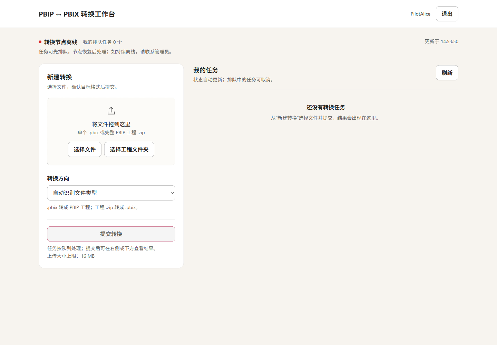
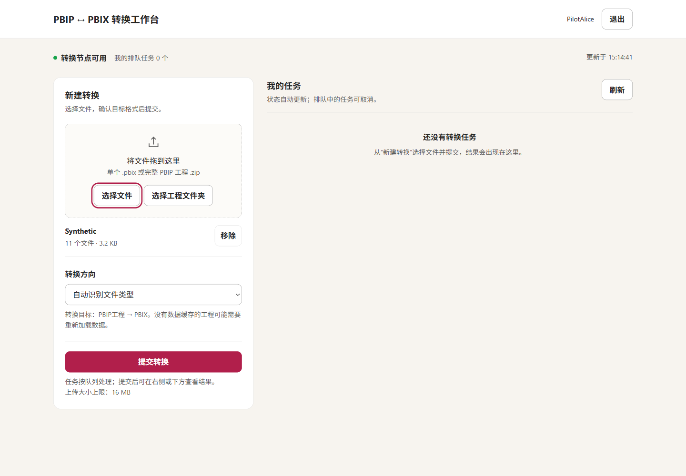
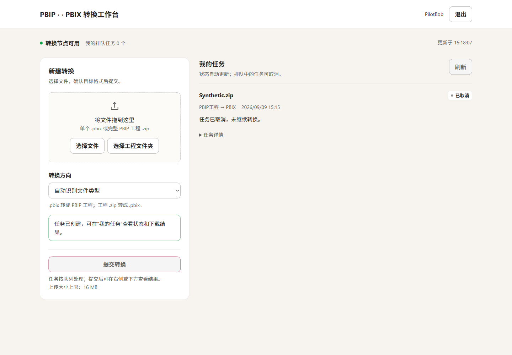
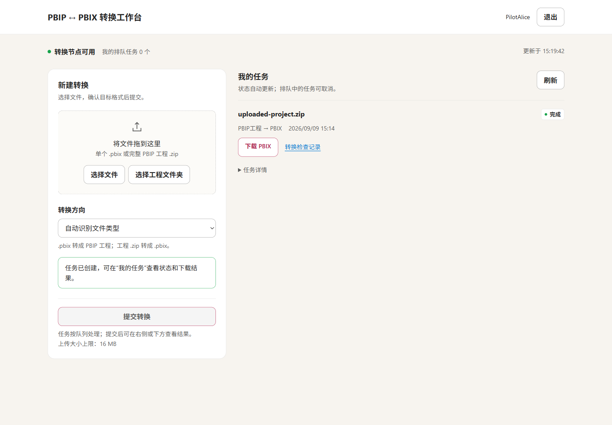

# 日常复跑与运维

> 公开版说明：保留原技术叙事与合成场景观察，部署定位参数已改为占位符。内部任务、身份、部署及截图来源回执不随仓库发布；公开成品与经过字段精简的 verification 见 [examples](../examples/README.md)。请先用自己的获准环境参数替换占位符。

本手册用于公网 HTTPS 双向转换服务。普通用户按第 1—5 节网页登录、提交和下载，不需要 SSH 密钥、本机隧道或 VM 桌面。管理员按第 6 节管理网关、Windows 登录、持久 portal、worker、身份及留存；首次安装见[完整指南第 4—5 章](01-完整方案与实操指南.md)，工程选择见[适用场景](03-验证结果与边界.md)。

## 1. 登录自己的工作台

在浏览器打开 `https://pbip-mcp-bidir-2d79425f.azurewebsites.net/`。这是公网 HTTPS 入口，可以在获准联网的电脑上访问；管理员另外分配独立个人凭证。无需安装 Azure CLI 或建立 SSH 隧道，也不需要直接访问 VM。公开的是入口，不是匿名任务或其他人的文件。

在“登录转换工作台”的“个人访问凭证”框填写自己的凭证，点击“登录”。登录后先核对右上角身份，再看顶部转换节点状态。不要把凭证写入 URL、聊天、上传包或共享截图，也不要与他人共用。



右上角是当前用户，右侧是该用户的任务。图中节点离线，说明网页服务可达但执行转换的 worker 不可用；任务虽可先排队，仍需管理员恢复桌面和 worker 才能处理。实际使用以页面当前状态为准。

页面打不开时，联系管理员检查 HTTPS 网关与私网 portal；登录会话到期时重新登录，个人凭证无效或被撤销时联系管理员处理身份。网页账号不是 Azure、Windows 或 Power BI 服务账号，不需要把这些密码填进此表单。证书或域名异常时停下核对入口，不改用明文 HTTP 发送凭证。

## 2. 选对输入和目标

在“新建转换”中选择文件，然后确认“转换方向”。输入必须来自你有权处理的工程，且符合当前支持范围。

| 手里的材料 | 网页动作 | 输出 |
|---|---|---|
| 一个受信任的 `.pbix` | “选择文件”，方向自动识别或选“PBIX → PBIP工程” | 完整 PBIP 工程 ZIP |
| 完整 PBIP 根目录 | “选择工程文件夹”，选包含入口、Report 与 SemanticModel 的根目录 | PBIX |
| 完整 PBIP `.zip` | “选择文件”，方向自动识别或选“PBIP工程 → PBIX” | PBIX |
| 单独 `.pbip` 入口 | 先补齐工程，不直接提交 | 页面提示完整工程要求并禁用提交 |



先看左侧已选工程名称，再看方向下的目标提示。图中还未创建任务，点击“提交转换”后才会进入“我的任务”。浏览器不支持文件夹选择时，使用完整 ZIP；不要把部署代码包当输入。

PBIX 转工程时，页面会显示“PBIP 工程内容”：

| 页面选项 | 适用目的 | 数据条件 |
|---|---|---|
| 可编辑工程（不含数据缓存） | 编辑、审阅、版本管理；默认 definitions | 保留定义，不带模型缓存；后续数值可能需要重新加载 |
| 完整工程（含数据，可用于离线转回） | 希望带着已有数据离线打开或转回 PBIX；portable | 只使用本任务 Desktop 导出的缓存，缺缓存会失败 |

definitions **不是脱敏选项**：查询与模型定义仍可能含内嵌数据、连接信息或敏感文本。portable 还包含模型数据，应按原 PBIX 的敏感级别保存与分享。

PBIP 转 PBIX 时，逐文件精确匹配的内置 `Synthetic`/`Rich` 样例可自动刷新；其他工程须有缓存，否则返回 `DATA_CACHE_REQUIRED`。需要数据源登录或刷新时，先在批准的 Desktop 环境人工处理，再提供完整工程，不在网页中上传数据库密码。

## 3. 提交后沿自己的任务查看结果

确认输入、目标与数据模式后，点击一次“提交转换”。请求成功后，“我的任务”出现该任务；多个用户可以同时排队，但一个 worker 只执行一个任务。状态自动更新，也可用“刷新”读取服务端结果。

| 页面状态 | 含义 | 下一步 |
|---|---|---|
| 排队 | 文件已接收，尚未被领取 | 等待；明确不再需要时可取消 |
| 处理中 | Desktop 正在打开、保存或复开 | 等待，不重复提交 |
| 完成 | 对应方向/模式的保存与复开完成 | 下载成品及转换检查记录 |
| 失败 | 当前任务停止，错误已记录 | 看错误与任务详情；修复原因后另建任务 |
| 已取消 | 在排队期间终止，未执行转换 | 不会生成成品 |



“已取消”与“完成”是不同终态；该项没有进入 GUI 转换，也不应出现下载成品。若刚看到排队，点击时已经被领取，取消可能被拒绝，此时刷新查看当前状态。

上传中断、页面刷新或登录失效时，重新进入**同一身份**的“我的任务”寻找原项，不立即再次上传。任务 ID 可从详情保留，便于管理员定位。换成另一身份看不到原任务，是授权行为，不是文件丢失；不能用他人的 ID 绕过权限。

## 4. 下载并按数据模式使用

完成后点击“下载 PBIX”或“下载 PBIP 工程 ZIP”，另取“转换检查记录”。先将文件保存到新名字或新的工程目录，不覆盖已有交付版本。



同一任务下的两个入口分别取成品和记录。反向任务会把主下载入口换为 PBIP 工程 ZIP。下载失败但任务仍成功时，回到原项重新下载，不再转换一次。


下方是网页上传工程生成的 PBIX，上方用该确切 PBIX 经同身份公网 MCP 导出 portable 工程。两项都在“我的任务”中，分别有正确的文件类型与下载入口；不需要在网页重新上传一次来取回 MCP 任务。

PBIX 用兼容版本的 Desktop 打开。PBIP ZIP 则完整解压到新的短路径，保持入口、Report 与 SemanticModel 的相对关系，再打开 `.pbip`。definitions 重点检查定义和页面，并安排数据加载；portable 可使用随包缓存。销售样例核对 60，多页样例还要核对两页与加权金额 200，不能以“窗口打开了”替代业务验收。

需要离线往返时，从原 PBIX 导出 portable，然后把取得的工程 ZIP 作为**新任务**转回 PBIX。不要从其他用户目录寻找缓存，也不要把 definitions 的无缓存工程默认当作离线输入。完整的往返解释见主指南第 6 章。

新任务默认在终态后保留 24 小时，实际期限见任务详情。到期后管理员可执行维护；完成状态会保留，但已清理的文件显示过期，下载返回 `ARTIFACT_EXPIRED`。应在保留期内取回所需成品；过期需按原输入重新申请转换，不修改旧任务状态。

## 5. 遇到问题，或结束使用

| 现象或错误 | 用户动作 | 管理员/作者负责什么 |
|---|---|---|
| 页面不可达或连接失效 | 保留原任务信息，等待恢复后重新登录 | 检查 App Service、VNet 到 VM 的路径与 portal 任务 |
| 节点离线或持续排队 | 不重复提交；必要时取消仍排队的任务 | 查 VM、解锁桌面、worker 新鲜心跳 |
| `DATA_CACHE_REQUIRED` / `PORTABLE_CACHE_MISSING` | 按任务详情确认所需模式 | 作者处理数据加载；不借其他任务缓存补齐 |
| `PBIX_INVALID` / `PBIX_UNSUPPORTED` | 检查输入和支持范围 | 在 Desktop 人工确认格式、本地模型与连接模式 |
| 标签、法律、安全或登录提示 | 不尝试自动绕过 | 由有权人员确认可处理条件，保留保护措施 |
| `JOB_NOT_FOUND` | 核对是否用原身份、原任务 | 检查授权或已撤销身份，不共享管理员凭证 |
| 任务失败 | 保存错误码和输入版本 | 修复具体原因后建立新任务 |
| 完成但下载失败 | 在同一身份下重新下载原项 | 查通道、下载租约和产物是否过期 |

取回文件后点击右上角“退出”。关闭网页或退出只结束自己的访问，不停止其他用户任务，不关闭 VM 或 worker。持续使用、暂停服务和云资源释放由管理员按批准窗口安排。

## 6. 管理员：恢复环境、通道与服务

以下命令仅供管理员维护已有环境。公网用户流量经 App Service 与 VNet 到 VM，不经过管理员电脑；Bastion/RDP 用来维持桌面，SSH 只作运维。第 6.2—6.3 节是可选的远端命令通道，已在 VM 管理终端操作时无需另建本机 SSH 隧道，可直接使用第 6.4 节持久 portal 管理入口。持久任务不依赖本机终端，却仍依赖专用用户登录。

### 6.1 每次都先恢复前提

确认既有 VM 在批准窗口内运行，Bastion 已连接并解锁 `pbipdemo` 的正常 Windows 桌面；不要从 SSH Session 0 直接运行 Desktop 或 worker。若已关机，由资源负责人按批准流程恢复，不自动新建资源、延长预算或绕过组织登录要求。

每次查看 VM 的实际电源、Windows 用户会话和 worker 心跳。当前试用按授权将 VM 自动关机设为 Disabled，避免定时中断；它不自动登录或解锁，也不改变 worker 默认空闲 30 分钟退出、任务最长 2 小时的限制。空闲退出后显式 Start。持续运行的 VM、Bastion、App Service Plan 和保留存储均需预算，任何停机策略调整都应与用户任务及下载协调。

| 现有演示环境配置 | 值 |
|---|---|
| Subscription | `<SUBSCRIPTION_ID>` |
| Resource group | `<WORKER_RESOURCE_GROUP>` |
| VM | `<VM_NAME>` |
| Bastion | `<BASTION_NAME>` |
| SSH HostKeyAlias | `approved-worker-host` |
| VM 部署根目录 | `C:\PBIPMCP` |
| 公网网关资源组 | `<GATEWAY_RESOURCE_GROUP>` |
| 公网 Web App / 计划 | `pbip-mcp-bidir-2d79425f` / `<APP_SERVICE_PLAN>`，P1v3 Linux |
| 网关到后端 | VNet 子网 `<GATEWAY_SUBNET_CIDR>` → VM 私网 `<VM_PRIVATE_IP>:8765` |
| 本机运维隧道端口示例 | `50027` → VM SSH 22，仅供管理员；不承载公网用户流量 |

本机 Azure CLI 必须已有目标租户的批准登录；不要借用其他租户的 `AZURE_*` 凭据。SSH 私钥与已钉住指纹的文件由管理员在批准位置提供，**本资料夹不含它们**。只输入文件路径，不在聊天或命令日志里粘贴私钥内容。

### 6.2 终端 A：只维持自己的 Bastion SSH 隧道

执行位置：**本机 PowerShell 终端 A**。使用现有 Bastion，不创建任何资源；保持此命令运行，不要等它退出后才开终端 B。

```powershell
$Subscription = '<SUBSCRIPTION_ID>'
$ResourceGroup = '<WORKER_RESOURCE_GROUP>'
$BastionName = '<BASTION_NAME>'
$VmResourceId = "/subscriptions/$Subscription/resourceGroups/$ResourceGroup/providers/Microsoft.Compute/virtualMachines/<VM_NAME>"
$Port = 50027
az network bastion tunnel `
  --subscription $Subscription `
  --resource-group $ResourceGroup `
  --name $BastionName `
  --target-resource-id $VmResourceId `
  --resource-port 22 --port $Port --only-show-errors
```

端口占用、授权错误或 `banner exchange` 超时，先修复自己这条通道；不要关闭主机指纹校验、开放公网 SSH，或停止别人的端口进程。浏览器 RDP 和 SSH 隧道是两条连接，SSH 通不等于桌面可用。

### 6.3 终端 B：确认身份并让 worker 就绪

执行位置：**管理员本机 PowerShell 终端 B**。这里使用 0.2.3 部署工作目录，不在本资料夹创建 `.venv`。如果只拿到了包，先按完整指南将[rc6 / 0.2.3 源码与部署入口](../README.md)解压部署一次；不要每天重装或退回旧候选版本。

```powershell
$Desktop = [Environment]::GetFolderPath('Desktop')
$Project = Join-Path $Desktop 'powerbi-pbip-pbix-mcp-demo'
Set-Location -LiteralPath $Project
$Python = Join-Path $Project '.venv\Scripts\python.exe'
if (-not (Test-Path -LiteralPath $Python -PathType Leaf)) {
  throw 'Approved local client runtime is missing; complete setup first.'
}
$Port = 50027
$Identity = Read-Host 'Path of the approved SSH private-key file'
$KnownHosts = Read-Host 'Path of the pinned known_hosts file'
foreach ($Path in @($Identity, $KnownHosts)) {
  if (-not (Test-Path -LiteralPath $Path -PathType Leaf)) {
    throw 'An approved SSH identity or host-pinning file is missing.'
  }
}
$HostKeyAlias = 'approved-worker-host'
$SshOptions = @(
  '-T', '-p', [string]$Port, '-i', $Identity,
  '-o', "UserKnownHostsFile=$KnownHosts",
  '-o', "HostKeyAlias=$HostKeyAlias",
  '-o', 'StrictHostKeyChecking=yes',
  '-o', 'IdentitiesOnly=yes', '-o', 'BatchMode=yes',
  '-o', 'ConnectTimeout=15'
)
ssh @SshOptions pbipdemo@127.0.0.1 whoami
if ($LASTEXITCODE -ne 0) { throw 'SSH failed; do not submit.' }
ssh @SshOptions pbipdemo@127.0.0.1 'query user'
```

核对 `whoami` 返回的机器和用户是否与批准目标一致；`query user` 中该用户应为 Active，同时在 Bastion 中确认桌面未锁定。会话列表只能说明登录连接状态，不能替代对锁屏的判断。身份与桌面都正确后，建立管理和 MCP 参数并启动 worker：

```powershell
$WorkerConnection = @{
  Port = $Port; Identity = $Identity; KnownHosts = $KnownHosts
  HostKeyAlias = $HostKeyAlias
}
$McpConnection = @(
  '--port', [string]$Port, '--identity', $Identity,
  '--known-hosts', $KnownHosts, '--host-key-alias', $HostKeyAlias
)
.\scripts\remote-worker.ps1 @WorkerConnection -Action Doctor
.\scripts\remote-worker.ps1 @WorkerConnection -Action Start
.\scripts\remote-worker.ps1 @WorkerConnection -Action Status
```

继续提交要看 **worker.ready=true**，不是仅看计划任务 Running。Doctor 中的 `caller_session` 指管理命令所在会话，经 SSH 调用时为 0 是正常的；实际 worker 应位于已连接解锁的普通用户交互会话。ready 表示可以接单，busy 表示已有任务在执行，新任务会排队。Start 幂等复用同一任务并保留已注册参数；现有演示环境使用 `ReviewSeconds=20`，不要在日常启动时重新 Register 或改动它。

需要辨认输出字段时，可对照[Start/Status 界面](assets/screenshots/10-live-worker-start-status.png)，重点看用户会话、`already_running` 与 worker 的 ready/idle。图中的 Administrator 标题属于管理终端；转换任务仍以 **Interactive + Limited** 运行，不需要提升 worker 权限。

### 6.4 管理持久 portal，核对网关与转换节点

公网 portal 使用 `PBIPMCP-PublicPortal` 计划任务，主体为 `pbipdemo`、Interactive + Limited，并在该用户登录时触发。前提是身份配置已按第 6.8 节放在受保护的 `C:\PBIPMCP\pilot-auth-bidir\users.json`，专用用户已登录，没有另一份前台 portal 占用 VM 私网 8765。已有任务先查状态，不每天 Register。

在 **VM 管理员 PowerShell** 执行：

```powershell
$PortalManage = 'C:\PBIPMCP\app\scripts\manage-public-portal.ps1'
$PublicOrigin = 'https://<APP_NAME>.azurewebsites.net'
$BindAddress = '<VM_PRIVATE_IP>'
& $PortalManage -Action Status -PublicOrigin $PublicOrigin -BindAddress $BindAddress
```

若是新部署且没有注册任务，才执行以下一次性分支；脚本会核对已有任务的主体、程序和参数，不覆盖不匹配任务。

```powershell
& $PortalManage -Action Register -PublicOrigin $PublicOrigin -BindAddress $BindAddress
& $PortalManage -Action Start -PublicOrigin $PublicOrigin -BindAddress $BindAddress -WaitSeconds 30
& $PortalManage -Action Status -PublicOrigin $PublicOrigin -BindAddress $BindAddress
```

已有任务未运行且并未被停用时，只需 Start、Status。它等待真实 portal 响应，而不只看计划任务的 Running 标签。**曾显式 Stop 的任务会被停用**，Start 不会替管理员重新启用；确认批准恢复后，在同一 VM 管理终端执行这个独立分支：

```powershell
Enable-ScheduledTask -TaskName 'PBIPMCP-PublicPortal' | Out-Null
& $PortalManage -Action Start -PublicOrigin $PublicOrigin -BindAddress $BindAddress -WaitSeconds 30
& $PortalManage -Action Status -PublicOrigin $PublicOrigin -BindAddress $BindAddress
```

AtLogon 是登录触发，不是开机替用户登录。关闭本机 SSH 终端不停止此任务，但注销 `pbipdemo` 会使它失去前提；失败重启是有限次数，也不使服务成为无人值守平台。portal 不启动或停止 worker，两者分别查状态。若未采用第 6.3 节的 SSH 管理路径，在 **VM 管理终端**使用以下等价入口：

```powershell
$WorkerManage = 'C:\PBIPMCP\app\scripts\manage-worker.ps1'
& $WorkerManage -Action Doctor
& $WorkerManage -Action Start
& $WorkerManage -Action Status
```

公网流量由 P1v3 Linux App Service 接收，再经专用 VNet 子网到 VM。NSG 与 Windows Firewall 只允许 `<GATEWAY_SUBNET_CIDR>` 访问 `<VM_PRIVATE_IP>:8765`，不开放 VM 公网转换端口或 RDP。网关保留用户身份和请求 Origin，后台仍执行 Cookie/CSRF 或个人 MCP 认证。FTP/SCM 基本发布凭据已关闭，维护使用批准的发布方式，不为排障重新开放基本凭据。

先判断公网 `/healthz` 和首页是否可达，再检查个人登录，最后查看登录后的 worker 状态。健康端点只说明网关能探测后端身份接口，不代表 Desktop 可接单。遇 401 要分清匿名访问和无效个人身份；错误 Origin/缺 CSRF 的拒绝应保留，不以移除校验来“修复登录”。

旧的本机回环转发和 `start-portal.ps1` 属于另一种私有配置，不能与当前绑定私网、校验公网 origin 的门户混用。管理员 SSH 密钥仍不分发给最终用户，公网 HTTPS 也不等于企业 SSO。

网络配置与脚本参数见[网关部署入口](../deploy/public-gateway/README.md)。公开脚本要求显式传入自己的私网地址；从原部署迁移已注册任务时须在批准维护窗口内审查注册参数，不覆盖不匹配任务。每次是否可用仍按当前入口和节点状态判断。

### 6.5 可选：管理员用 SSH 客户端检查正向路径

执行位置：**管理员本机 PowerShell 终端 B**，先建立第 6.3 节变量并保留终端 A 的运维隧道。`sample\Synthetic.zip` 是完整输入，外层部署包不是 `--zip` 输入。该分支用于维护诊断；普通用户用网页，程序用主指南第 7.2 节带 `--allow-public-https` 的个人 HTTPS MCP 示例。

```powershell
$Stamp = (Get-Date).ToUniversalTime().ToString('yyyyMMdd-HHmmss-fff')
$Prefix = Join-Path $Desktop "PBIP-MCP-Run-$Stamp"
& $Python .\scripts\run-remote-demo.py @McpConnection `
  --zip .\sample\Synthetic.zip `
  --output "$Prefix.pbix" `
  --verification "$Prefix.verification.json" `
  --result-json "$Prefix.e2e.json" `
  --timeout 900 --wait-ready 30
if ($LASTEXITCODE -ne 0) {
  throw 'Client failed; inspect the receipt and original job ID before retrying.'
}
$Result = Get-Content -LiteralPath "$Prefix.e2e.json" -Raw |
  ConvertFrom-Json
if (-not $Result.ok -or $Result.job.status -ne 'succeeded') {
  throw 'The receipt does not confirm a successful conversion.'
}
Get-Item -LiteralPath "$Prefix.pbix", "$Prefix.verification.json",
  "$Prefix.e2e.json" | Select-Object Name,Length
Get-FileHash -LiteralPath "$Prefix.pbix" -Algorithm SHA256
Get-Content -LiteralPath "$Prefix.verification.json" -Raw
```

提交后立即保留 `submitted` 事件中的 `job_id`，它是网络中断后继续查询的依据。正常完成时，本机得到 PBIX、`verification.json` 和 `e2e.json`：前者是成品，第二份记录 Desktop 保存与新进程复开，第三份记录客户端调用及下载。验证回执应包含 `converter=power-bi-desktop-ui`、`reopened_in_fresh_desktop=true` 和基线卡片 60；客户端还会核对下载长度与摘要。

转换期间保留桌面连接，不操作 worker 的窗口。出现未知弹窗时，由 worker 明确失败并留下诊断，随后按下一节处理。扩展样例只把输入换为 `sample\Rich.zip`，使用另一个新前缀，并按完整指南第 6 章核对两页、5 个视觉对象和总金额 60、加权金额 200。

客户端 `--timeout 900` 与服务端单次转换 600 秒是不同期限；`--wait-ready 30` 只限提交前等待。客户端超时不等于服务端失败，不能立即重复提交。

### 6.6 未完成时，沿原任务继续处理

客户端超时、SSH 断开或成品未取回时，先恢复终端 A 的隧道并确认 SSH 身份，再查询原任务。管理员诊断终端重开后，先重建第 6.3 节变量与连接参数。HTTP/网页用户则恢复自己的访问入口和身份，不改用 SSH 管理身份代替用户授权。

```powershell
$JobId = Read-Host 'Previously recorded job ID'
$Tag = (Get-Date).ToUniversalTime().ToString('yyyyMMdd-HHmmss-fff')
$JobReceipt = Join-Path $Desktop "PBIP-MCP-Job-$Tag.json"
& $Python .\scripts\run-remote-demo.py @McpConnection `
  --action job --job-id $JobId --result-json $JobReceipt
if ($LASTEXITCODE -ne 0) { throw 'Query failed; restore access before retrying.' }
$JobResult = Get-Content -LiteralPath $JobReceipt -Raw | ConvertFrom-Json
$JobResult.job | Format-List
```

| 实际状态或错误 | 应做的事 |
|---|---|
| SSH 不通 / banner 超时 | 重建自己终端 A 的通道，再确认 whoami；不向失效通道反复提交 |
| worker notready/stale（未就绪或心跳过期） | 查正常用户桌面与心跳，恢复后 Start；不要从 Session 0 启 Desktop |
| queued | 等待可用 worker；明确放弃时才能用 cancel，领取后取消可能被拒绝 |
| running | 等待有界终态，不重复提交或手工改状态 |
| failed | 保留原件、任务和 error.code；修复原因后用新 ID，不把旧失败改成成功 |
| succeeded 但未下载 | 使用该 job_id 的 download；不用再次转换 |
| CLIENT_OUTPUT_EXISTS | 选新文件名，禁止覆盖旧成品 |

顶层 `ok=true` 可能只表示查询成功；转换是否成功以 `job.status` 为准。如果原任务已经 `succeeded`，但本机还没有成品，在**同一个管理员诊断终端**执行下面的下载分支，保留终端 A 的运维隧道。它读取原任务，不重新转换；已有文件保留，下载使用新名字。

```powershell
if ($JobResult.job.status -ne 'succeeded') {
  throw 'The original job has not succeeded; do not download a partial result.'
}
$Tag = (Get-Date).ToUniversalTime().ToString('yyyyMMdd-HHmmss-fff')
$DownloadPrefix = Join-Path $Desktop "PBIP-MCP-Download-$Tag"
& $Python .\scripts\run-remote-demo.py @McpConnection `
  --action download --job-id $JobId --kind pbix `
  --output "$DownloadPrefix.pbix" `
  --result-json "$DownloadPrefix.pbix-receipt.json"
if ($LASTEXITCODE -ne 0) { throw 'PBIX download failed; keep the original job ID.' }
& $Python .\scripts\run-remote-demo.py @McpConnection `
  --action download --job-id $JobId --kind verification `
  --output "$DownloadPrefix.verification.json" `
  --result-json "$DownloadPrefix.verification-receipt.json"
if ($LASTEXITCODE -ne 0) { throw 'Verification download failed; keep the original job ID.' }
Get-Content -LiteralPath "$DownloadPrefix.verification.json" -Raw
```

对于 `failed`，先读取 `error.code`：输入或定义错误由工程作者修复；`INTERACTIVE_SESSION_LOST` 先恢复普通用户桌面，再 Doctor/Start/Status。前提恢复后用新任务重新转换，保留旧失败记录。对于仍在排队但已不需要执行的任务，可使用[完整指南第 7.2 节](01-完整方案与实操指南.md)的取消分支；不要把取消和下载当成连续步骤。

### 6.7 结束批准的服务窗口

这不是普通用户退出网页后的动作。只有管理员获准结束服务窗口，才先协调停止新提交，确认排队任务、运行中转换、上传和持续下载均已处理。随后在 **VM 管理员 PowerShell** 停止具名 portal：

```powershell
$PortalManage = 'C:\PBIPMCP\app\scripts\manage-public-portal.ps1'
$PublicOrigin = 'https://<APP_NAME>.azurewebsites.net'
$BindAddress = '<VM_PRIVATE_IP>'
& $PortalManage -Action Stop -PublicOrigin $PublicOrigin -BindAddress $BindAddress
& $PortalManage -Action Status -PublicOrigin $PublicOrigin -BindAddress $BindAddress
```

Stop 先停用任务，防止登录或失败策略立即重启，再只终止自有 portal；不停止 worker。恢复时必须按第 6.4 节明确 Enable。然后在**已配置第 6.3 节变量的管理员本机终端 B**请求 worker 安全退出：

```powershell
.\scripts\remote-worker.ps1 @WorkerConnection `
  -Action Stop -WaitSeconds 30
.\scripts\remote-worker.ps1 @WorkerConnection -Action Status
```

若只在 VM 本地维护，则以上一节的 `$WorkerManage` 执行 `-Action Stop -WaitSeconds 30` 和 `-Action Status`，不必为了停止 worker 再新建 SSH 通道。

如果 30 秒还未停止，保留桌面和运维通道，使用更长但有限的等待，不把超时当作已经停妥。确认服务停妥后，再关闭自己的 Bastion SSH 隧道并退出 RDP。VM、Bastion、App Service Plan 和存储的保留/停止由资源负责人处理；停 portal 或 Web App 不等于释放所有计费资源。当前自动关机关闭，不能等待定时任务代替收尾。

保留本次任务 ID、输入版本、成品和对应回执，后续故障可沿同一条记录定位。原件与日志的归档、磁盘预算和 Desktop 升级由维护者按[完整指南第 7—8 章](01-完整方案与实操指南.md)处理。

### 6.8 个人身份与到期维护

首次分配用户时，在 **VM 的 `pbipdemo` 专用账户 PowerShell** 使用身份管理 CLI。当前公网任务读取 `C:\PBIPMCP\pilot-auth-bidir\users.json`；新增身份必须写到同一配置，而不是另建一份旧 `pilot` 配置。目录由管理员预先限制 ACL，只向该账户、SYSTEM 和管理员授予所需访问。以下为配置模板，不读取既有凭证明文；个人凭证文件不得放网页目录、源码包或资料夹。

```powershell
$Python = 'C:\PBIPMCP\app\.venv\Scripts\python.exe'
$AuthConfig = 'C:\PBIPMCP\pilot-auth-bidir\users.json'
$UserId = Read-Host 'New approved user ID'
$DisplayName = Read-Host 'Approved display name'
$CredentialFile = Read-Host 'New credential file path in the protected pilot-auth-bidir directory'
& $Python -m pbip_mcp.admin add-user `
  --auth-config $AuthConfig --credential-file $CredentialFile `
  --user-id $UserId --display-name $DisplayName
if ($LASTEXITCODE -ne 0) { throw 'Identity creation failed; do not distribute a credential.' }
```

普通用户默认 `user` 角色。服务端配置只存摘要，个人文件通过批准的私密渠道交给本人；同一凭证用于网页登录或个人 HTTPS MCP。已有用户或文件名会被拒绝。变更配置后，在协调的维护窗口用具名 Stop 停 portal，再按第 6.4 节明确 Enable、Start；不修改任何用户任务或凭借图中身份登录。

撤销时先协调停止 portal，再在**同一专用账户 PowerShell**执行下列独立分支，随后按第 6.4 节明确 Enable、Start。它不是新增用户后需要紧接执行的步骤。

```powershell
$Python = 'C:\PBIPMCP\app\.venv\Scripts\python.exe'
$AuthConfig = 'C:\PBIPMCP\pilot-auth-bidir\users.json'
$UserId = Read-Host 'Approved user ID to revoke'
& $Python -m pbip_mcp.admin remove-user `
  --auth-config $AuthConfig --user-id $UserId
if ($LASTEXITCODE -ne 0) { throw 'Revocation failed; inspect the protected user configuration.' }
```

重启使移除的身份不能继续登录或调用 MCP；已保存的任务记录不因此改为其他人的任务。常规角色分配、撤销与个人凭证轮换由管理员管理，当前机制不是组织 SSO。

留存维护是另一个动作。默认新任务终态后保留 24 小时，实际期限在接收任务时保存；达到期限不会自动后台删除，须由管理员显式执行。确认需要保留的产物已归档、明确本次到期范围后，在 **VM 管理员维护终端**运行：

```powershell
$Python = 'C:\PBIPMCP\app\.venv\Scripts\python.exe'
& $Python -m pbip_mcp.admin status --data-dir C:\PBIPMCP\data
if ($LASTEXITCODE -ne 0) { throw 'Cannot inspect storage state; stop maintenance.' }
& $Python -m pbip_mcp.admin cleanup --data-dir C:\PBIPMCP\data
if ($LASTEXITCODE -ne 0) { throw 'Retention maintenance failed; inspect its error and audit.' }
```

一次最多处理有界数量的到期新任务，保留数据库历史与维护审计；不删迁移前 legacy 任务、旧原件或本资料夹。运行中及持续下载的文件由任务状态和租约保护。HTTP 流中断留下的租约需先确认没有下载进程再人工检查，不能按时间猜测后强删。下载租约与过期语义详见主指南第 7.3 节。
