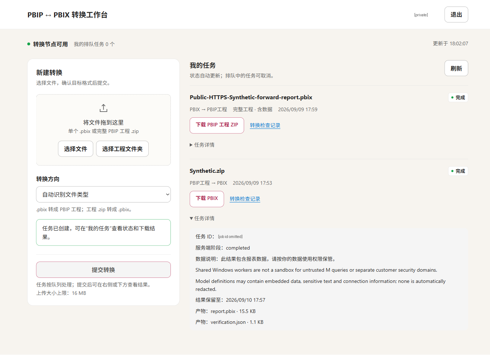

# PBIP ↔ PBIX 线上转换门户使用说明

> 公开版说明：保留原技术叙事与合成场景观察，部署定位参数已改为占位符。内部任务、身份、部署及截图来源回执不随仓库发布；公开成品与经过字段精简的 verification 见 [examples](../examples/README.md)。请先用自己的获准环境参数替换占位符。

**正式公网地址：https://pbip-mcp-bidir-2d79425f.azurewebsites.net**；登录后，你可以上传单个 PBIX，或完整 PBIP 工程 ZIP / 选择工程文件夹，并在“我的任务”中跟踪状态和下载结果。

这个公网门户把 Power BI 的 PBIX 文件与完整 PBIP 工程相互转换。已有 PBIX、希望修改或管理模型与页面定义时，可以导出 PBIP；已有 PBIP、需要交付可由 Power BI Desktop 打开的文件时，可以生成 PBIX。

转换在服务端的 Desktop 中完成，使用网页不需要安装客户端、领取 SSH 密钥、建立 SSH 隧道或登录远端 Windows。下载后若要打开和编辑成品，本机仍需兼容版本的 Power BI Desktop。

## 1. 是否需要密码？

**需要个人访问凭证。它在使用上等同于密码，应由管理员单独分配，不能与他人共用。** 登录框不是微软账号、Azure 账号、Windows 账号或 Power BI 服务的密码框，不要把这些密码填进去。

在“个人访问凭证”框输入自己的凭证并点击“登录”。服务验证后，凭证会换成 `Secure + HttpOnly + SameSite=Strict` 会话 Cookie，用它维持会话；不需要每次点击任务都重新输入凭证。这个 Cookie 仅经 HTTPS 发送，不供页面脚本读取，并限制跨站携带。提交、取消和退出等变更操作还会检查 CSRF 令牌与请求来源，避免其他网站借你的登录发起操作。

登录后先看右上角是否是自己的身份。匿名访问者可以看到登录入口，但不能查看任务、提交文件或下载产物。任务在服务端关联所有者（owner）；普通用户只看到自己的列表，查询、取消和下载也都检查归属。**下载链接即使包含任务 ID，也不是凭链接即可共享的公开文件。** 未登录会被拒绝，其他普通用户访问不属于自己的任务会得到 404；知道 URL 不能代替授权。

当前认证方式是 `pilot-token`，即受控试点的个人凭证机制，不是已经接通的企业单点登录。正式客户试点应由平台团队规划 Microsoft Entra ID、OIDC 或其他组织身份接入，并确认组织认可的 HTTPS 入口、身份映射、撤销与审计规则。个人凭证通过批准的私密渠道交付，不放到 URL、聊天记录、工程包或共享截图里。

## 2. 完成一次转换的最短路径

1. **登录。** 打开上方 HTTPS 地址，输入个人凭证。先确认身份，再看“转换节点”状态；节点离线时可以联系平台运维，网页能打开不等于 Desktop 已就绪。
2. **选择输入。** `.pbix` 用“选择文件”；完整 PBIP ZIP 也用“选择文件”；工程目录用“选择工程文件夹”，选择包含入口、Report 和 SemanticModel 的根目录。孤立的 `.pbip` 只是入口，不能单独转换。浏览器不支持文件夹选择时，改用完整 ZIP。
3. **确认方向与内容。** 可以保留“自动识别文件类型”，也可以明确选择 PBIX → PBIP 或 PBIP → PBIX。输入 PBIX 时，再选择下面解释的 definitions 或 portable；它决定工程是否携带模型缓存。
4. **提交一次。** 点击“提交转换”，随后在“我的任务”查看排队、处理中、完成或失败。记录任务 ID，页面刷新或网络中断后先查询原任务，不立即重复上传。
5. **下载并使用。** 成功后下载主产物，以及“转换检查记录”对应的 `verification.json`。保存到新名字或新的工程目录，不覆盖已有版本。PBIP ZIP 应完整解压后再打开入口，不能只从 ZIP 中取出一个 `.pbip`。
6. **退出。** 取回需要的文件后点击右上角“退出”。退出只结束个人访问，不停止共享节点或其他用户的转换。

多人可以提交任务，但单个 worker——实际驱动 Desktop 的工作进程——一次只处理一个。等待时间既受当前任务影响，也受节点是否可用影响；列表中的排队不是转换失败。

## 3. 导出工程时，为什么有两种数据模式？

PBIP 是一组相互引用的工程文件。报表目录保存页面和视觉对象，语义模型目录保存表、关系、计算和数据加载规则。模型缓存 `cache.abf` 则承载已导入的数据；有定义不等于已经有可离线使用的模型数据。微软对 PBIP 目录与入口的说明见[官方项目概览](https://learn.microsoft.com/en-us/power-bi/developer/projects/projects-overview)。

| 页面选项 | 接口中的模式 | 适合什么工作 | 数据含义 |
|---|---|---|---|
| 可编辑工程（不含数据缓存） | `definitions`，默认 | 编辑、审阅、版本管理 | 保留定义与允许的资源，不带模型缓存；重新使用数值可能需要加载数据 |
| 完整工程（含数据，可用于离线转回） | `portable` | 保留现有离线数据、打开工程或转回 PBIX | 携带本任务 Desktop 导出的缓存；缺少所需缓存会明确失败 |

**definitions 不是脱敏选项。** M 是数据加载与变换表达式，TMDL 是模型的文本定义；它们自己就可能包含内嵌数据、查询文本、参数、连接信息或敏感名称。删除缓存不会自动删除这些内容。因此，即使看到 `contains_data=false`，仍要审查工程是否适合分享或进入代码仓库。

portable 的缓存应按原始数据权限和敏感级别保护。它来自当前转换任务，不从其他用户或其他任务共用、补齐数据。所谓可离线回转，是在支持的模型与缓存条件下继续转换，不表示所有连接器、业务计算和视觉对象都获得通用兼容承诺。

将 PBIP 转为 PBIX 时，一般工程需要在所引用的语义模型目录中自带非空 `.pbi/cache.abf`。只有逐文件精确匹配的内置合成样例允许自动刷新；rc7 对非内置工程缺缓存的请求，在**创建任务、保留上传文件和入队之前**返回 `DATA_CACHE_REQUIRED`。这不是“我的任务”中新增一个失败任务，ZIP、文件夹与 MCP 入口遵循相同规则。外部源的凭据、网络、刷新授权和参数由工程作者在批准环境中处理，不通过在上传包里塞入密码来解决。

definitions 导出仍会实际另存工程、剔除缓存和本机设置，再用独立副本新进程复开，不刷新数据。关闭这个复开窗口时，worker 最多处理两个不同的已识别保存决定窗口，每个仅丢弃一次，且必须属于本任务进程；未知或保护类提示不会自动点击。用户无需也不应进入远端桌面替任务关闭对话框。

## 4. “任务完成”和“文件可下载”是两件事

先读任务状态 `status`，判断转换结果；再看产物状态 `artifact_status`，判断有没有可取回的文件。

| 任务状态 | 页面含义 | 你应该做什么 |
|---|---|---|
| `queued` | 已接收，等待 worker 领取 | 等待；不再需要时可取消 |
| `running` | 正在打开、保存或重新打开结果 | 等待，不干预远端窗口，也不重复提交 |
| `succeeded` | 该方向、该模式的转换与复开成功 | 查看产物是否可用，下载主文件与 verification |
| `failed` | 已失败并结束，任务带错误信息 | 保存错误和输入版本，修复原因后创建新任务 |
| `cancelled` | 排队期间取消，未完成转换 | 没有成功产物；需要执行时重新提交 |

| 产物状态 | 如何理解 |
|---|---|
| `pending` | 尚无可下载的成功产物。失败或取消的任务也可能显示它，不表示以后还会自动生成文件 |
| `available` | 成功产物可供当前有权用户下载 |
| `expired` | 产物已由到期维护清理，不能继续下载；任务历史结果仍保留 |

因此，`succeeded + expired` 并不矛盾：转换曾经成功，但文件不再留存。`failed + pending` 则不需要继续等待产物，应读错误原因。

## 5. 展开“任务详情”后，各字段在说什么？

下图是实际公网工作台。先看下方完整销售工程生成 PBIX，再看上方以那份 PBIX 导出的 portable 工程。两项分别有自己的状态、内容模式与下载入口；网页提交的任务和同一身份从 MCP 提交的任务出现在同一列表。

**任务 ID：找回同一项工作的索引。** 它是不透明的唯一标识，用于查询、联系支持和关联下载，不含需要用户解码的业务信息。保留它就能在连接恢复后找原任务；它不是密码，也不授予任何文件权限。

**服务端阶段：后台流程是否已经结束。** `phase=completed` 表示后台流程已经结束，是否成功仍要看 `status`；失败任务也可以结束，因此可能看到 `phase=completed` 与 `status=failed` 同时出现。“不再运行”不等于“已经成功”，状态与错误信息比只看到一个阶段词更重要。

**数据说明：当前产物是否带着模型数据。** 对反向 portable 任务，“完整工程·含数据”表示 ZIP 中带有本任务的模型缓存；对 PBIX 产物则表示其中包含模型数据。它不意味着缓存跨用户共享，也不表示数据已脱敏。definitions 的说明则提示后续可能需要重新加载。

**第一条英文提示：共享 Windows 不是不可信代码沙箱。**

> Shared Windows workers are not a sandbox for untrusted M queries or separate customer security domains.

含义是：任务所有权检查可以保护网页与接口中的文件访问，却不能把同一个 Windows 运行账户变成多个独立安全域。恶意 M 查询、连接器或不同客户的隔离需求不能仅靠“各有一个登录账号”解决。不可信输入或跨客户使用，应由平台团队采用独立 worker、VM 或其他经过设计的安全域。

**第二条英文提示：工程定义没有自动脱敏。**

> Model definitions may contain embedded data, sensitive text and connection information; none is automatically redacted.

含义是：导出的模型定义中仍可能有内嵌数据、敏感文本与连接信息，转换器不会自动删掉它们。分享给同事、放入 Git 或转交外部接收方之前，仍要按数据管理要求审查；选择 definitions 也不能省略这一步。

**保留至：应在此时间前保存自己的交付副本。** 字段 `retention_deadline` 给出任务文件的保留期限，当前新任务默认在终态后保留约 24 小时。到期后文件进入清理资格；实际清理后 `artifact_status=expired`，下载返回 HTTP 410，成功任务的历史记录仍保留。它不是精确到秒强行中断下载的计时器，但也不能依赖到期后暂未清理的文件继续可用。请将显示期限作为自己下载保存的截止安排。

**`report.pbip.zip`：完整工程，而非单独入口文件。** 包里包含入口、Report、SemanticModel 及允许的资源；portable 模式另带模型缓存，definitions 则不带缓存。应整包下载、完整解压并保持相对目录关系。正向转换的主产物是 `report.pbix`。

**`verification.json`：与该任务对应的机器可读核对记录。** 它帮助把输入、转换方向、实际保存与新进程复开结果连在一起，适合与主产物一同保存。下面解释它的用途和限制。

## 6. 每个任务都有 verification 吗？它能证明什么？

**每个成功完成转换的任务都会生成 `verification.json`，并作为可下载产物提供。** queued 和 running 尚未完成；failed 或 cancelled 不提供成功的验证文件，应从任务错误与诊断查原因。失败处理中可能存在内部诊断，但它们不是可交付的成功 verification。成功任务经到期清理后，这份记录也可能无法再下载。

verification 是本任务“由 Desktop 实际保存，并用新进程重新打开结果”的机器可读核对记录。它不是上传前随手生成的格式说明，也不是把网页状态转成另一种文件。按照转换方向与实际场景，它会包含下列字段：

| 字段或字段组 | 用来回答什么 |
|---|---|
| `job_id`、`direction`、反向的 `export_mode`、`source_sha256` | 对应哪个任务、转换方向、导出模式和输入文件；摘要用于关联内容，不是业务正确性判断 |
| `converter`、`desktop_version` | 用了哪种转换引擎及 Desktop 版本 |
| `desktop_pid`、`reopened_pid`、`reopened_in_fresh_desktop` | 原打开进程与复开进程是否分开，是否真正从输出重新打开；PID 只是进程标识 |
| `pages`、`visual_count` | 观察到的页面和视觉对象数量，帮助发现结构缺失 |
| `contains_data`、适用时的 `requires_data_reload` | 是否携带缓存/模型数据，以及是否需要后续加载；不等于内容已经脱敏 |
| `data_refresh_policy` | 使用什么刷新策略，例如 portable 反向不自动刷新，正向仅允许精确内置样例按规则刷新 |
| `verification_method`、`data_values_verified`、样例观测字段 | 采用了怎样的检查；哪些可信样例业务值实际被观察到 |

有些字段只适用于一个方向或某种模型，不应要求每份 JSON 都有完全相同的字段集合。任务详情使用 `requires_data_reload`；部分正向 verification 不单独输出这个字段，应结合转换方向与刷新策略阅读。

销售样例的三行金额是 10、20、30，卡片总额为 **60**；Rich 样例还用关系取得权重，观察到加权金额 **200**。这些值用于核对已知输入的计算与页面绑定。对自己的报表，仍需要另外检查关键业务口径、筛选、角色权限和页面交互。

**verification 不是安全审计证书、内容脱敏证明，也不是任意 DAX 或逐行数据完全等价的证明。** “页面数量一致”“新进程能打开”和“某个样例值正确”各自回答不同问题；它们不能自动覆盖所有业务规则。definitions 的复开重点是模型与页面定义，不能拿它的成功替代带数据的离线往返。

当前公网链路已实际完成：同一公网普通用户先从原网页上传完整 Synthetic PBIP 工程并生成 PBIX，下载后再把这份确切 PBIX 通过公网 HTTP MCP 导出为 portable PBIP。两次转换都由新的 Desktop 进程复开成品并观察到 60；反向 ZIP 经网页与 MCP 下载的字节一致。可以对照[公开成品与 verification](../examples/README.md)，以及上方实际公网截图；公开截图已遮盖显示名与任务 ID，verification 已删除内部任务与进程编号。这是一条具体输入的结果，不代表任何工程都能无条件转换。

## 7. 常见问题与处理（FAQ）

**转换节点 offline 或 worker stale 怎么办？** 联系平台运维恢复交互式 Desktop 与 worker。`stale` 表示心跳过期；VM 显示 Running 只代表虚拟机通电，不等于转换节点 ready。普通用户不要尝试登录 VM 或取得运维密钥。

**页面或请求超时怎么办？** 记住原任务 ID，恢复访问后用同一身份查询原任务。超时不代表后台任务没有创建或已经停止，不要立即重复提交。

**失败任务怎么办？** 先阅读任务中的 `error`、错误码和诊断，确认是输入不完整、缺少缓存，还是节点环境问题。修正输入或环境后新建任务；旧失败任务会保留，不会自动变为成功，也不会继续生成成功产物。

**产物到期怎么办？** 在“结果保留至”之前下载并保存。实际清理后 `artifact_status=expired`，旧链接返回 HTTP 410；需要产物时，用自己保留的原输入重新提交，或联系平台确认是否有经过批准的归档。

**导出后会自动脱敏吗？** 不会。definitions 只是不包含缓存；M、TMDL、模型定义、内嵌数据、敏感文本和连接信息仍可能存在。portable 还包含当前任务的缓存，应按原数据权限保护。

**能否多人同时使用？** 可以同时提交并各自查看任务，但任务会在单个 Desktop worker 上串行执行。需要更高吞吐量或不同客户安全域时，平台应部署多个彼此独立的 worker / VM，而不是让同一个 Desktop 并行处理。

**为什么成功后有两个下载文件？** 主产物是 `report.pbix` 或完整的 `report.pbip.zip`，用于继续工作；`verification.json` 是机器可读核对记录，用于关联本次输入、Save As、成品与新进程复开。两者用途不同，建议一同保存。

**是否需要 Power BI 账号？** 转换本地 PBIX / PBIP 文件不需要登录 Power BI 服务；但把结果发布到 Power BI 或 Fabric、访问在线数据源与刷新数据，是另一套身份和授权流程。

如果任务有敏感度标签、登录、安全或法律提示，不通过自动点击或移除保护来继续。平台与工程作者需要先确认可处理范围。网页用户不承担 SSH、任务注册或 worker 重启；这些步骤归[运行手册的管理员部分](02-日常复跑与运维.md)。

## 8. 平台团队需要承担哪些运行责任？

公网 HTTPS 由 Azure App Service 托管域名提供，网关通过 VNet integration 访问 Windows VM 私网地址 `<VM_PRIVATE_IP>:8765`；VM 不向公网开放转换端口 8765 或 RDP。VNet integration 解决的是 App Service **向私网发起连接**，不是自动把公网网站变成仅内网可访问的站点，详见[官方 VNet 集成说明](https://learn.microsoft.com/en-us/azure/app-service/overview-vnet-integration)。

App Service 不是转换引擎。真正的转换仍由 Windows VM 上的 Power BI Desktop worker 单实例串行执行，要求 `pbipdemo` 已登录，并保持 RDP 会话 **Active、未锁定**。门户任务已固化为 `AtLogon`、`Interactive + Limited`，不依赖管理员本机 SSH 终端，但它不是以 `SYSTEM` 身份运行的无人值守服务，也不会替 Windows 用户登录或解锁。

本次 rc7 / 0.2.4 部署已将 worker 的 `IdleTimeout` 设为 `0`，计划任务执行期限为 `PT0S`，保留原 `ReviewSeconds=20`；不再因空闲 30 分钟或两小时任务期限而退出。单次转换仍有时间上限，断连、锁屏或进程故障仍需管理员恢复；没有新增自动登录、解锁或守护进程。门户在线不等于 worker 就绪，提交前仍以最新节点状态为准。

多人可同时提交并排队，不代表一个 worker 会并行操作多个 Desktop。扩大吞吐量要规划独立执行节点；涉及不可信客户或不同安全域时，还要同时隔离 VM、存储、身份、网络和诊断访问，而不是只增加网页账号。

当前测试 VM 的 auto-shutdown 配置为 `Disabled`，这是环境配置，不是可用性 SLA。VM、Bastion、App Service Plan 与存储的保留都会产生相应成本；这个配置也不是高可用设计。正式试点仍需约定允许的输入、数据处理地点、使用窗口、留存与归档、支持人、凭证撤销和事故处理方式。

## 9. 什么情况下应使用其他路线？

本门户适合受控、重复的 **PBIX 与 PBIP 文件转换**。如果任务少、数据源提示多且需要人工判断，直接在 Desktop 中另存为往往更合适；如果最终只需要在线报表，Fabric 定义部署或在线报表创作应单独评估。微软说明 PBIX/PBIP 转换使用 Desktop 的 File → Save as，未提供公开的程序化转换 API；本门户自动操作的是这条原生路径，而不是另一种官方无头引擎。

完整的同任务横向比较，包括 pbi-tools 的格式与输出边界，见[01 第 9 章](01-完整方案与实操指南.md)。外部数据源、复杂模型、自定义视觉对象和不同云环境的采用条件见[03 场景与边界](03-验证结果与边界.md)；日常操作与管理员职责见[02 运行手册](02-日常复跑与运维.md)，项目与文件入口见[README](README.md)。

本文所用产品依据：[Power BI Desktop projects 官方概览](https://learn.microsoft.com/en-us/power-bi/developer/projects/projects-overview)、[App Service VNet integration 官方说明](https://learn.microsoft.com/en-us/azure/app-service/overview-vnet-integration)。公开实现入口为[网关与部署说明](../deploy/public-gateway/README.md)，可下载证据为[合成成品与精简 verification](../examples/README.md)；原始部署、身份验收和截图来源回执不公开。
